# Distributed Systems Lego Catalog

This catalog names distributed-systems building blocks as a dependency graph.
It is intentionally broader than the current Manyfold implementation. The goal
is to make reusable low-level concepts visible before they are hidden inside
larger components.

## Component Schema

Each lego should be described with the same shape:

- `name`: conceptual component name.
- `role`: primary purpose, such as persistence, handoff, flow, coordination,
  observability, or recovery.
- `layer`: dependency category, not implementation difficulty.
- `contract`: what callers can rely on.
- `requires`: lower-level legos this component needs.
- `provides`: capabilities, properties, or outputs this component offers.
- `inputs`: data, signals, policies, or events it consumes.
- `outputs`: data, signals, state, or events it emits.
- `state`: what it remembers, if anything.
- `failure_semantics`: behavior across crash, retry, timeout, duplicate,
  partition, or stale ownership.
- `composition_rules`: legos it commonly connects to.
- `operational_knobs`: limits, timeouts, retries, durability, consistency,
  retention, priority, and fairness settings.
- `group`: optional installer or ownership label used to link low-level
  components back to the component that assembled them.

## Layers

These layers are not a stack. They are a way to keep small, reusable concepts
from being mislabeled as high-level systems.

- `atom`: IDs, timestamps, sequence numbers, offsets, terms, deadlines.
- `policy`: retry, timeout, ordering, overflow, retention, durability,
  consistency, rate, security.
- `property`: idempotent, durable, ordered, replayable, bounded, fenced,
  at-least-once, at-most-once.
- `capability`: read, write, append, ack, nack, reserve, release, renew,
  publish, subscribe.
- `local`: clock, timer, buffer, queue, ring buffer, sampler, retry loop,
  watchdog.
- `durable`: byte store, keyspace, WAL, event log, snapshot, checkpoint,
  idempotency store.
- `distributed`: membership, lease, quorum, leader election, consensus,
  replication, routing.
- `application`: worker, workflow, sensor pipeline, reconciler, rollout
  controller.

## Lowered Families

### Atoms

`Bytes`, `Key`, `NodeId`, `ServiceId`, `TenantId`, `PrincipalId`, `RequestId`,
`MessageId`, `CorrelationId`, `CausalityId`, `TraceId`, `SpanId`, `Token`,
`Version`, `Generation`, `Epoch`, `Term`, `SequenceNumber`, `Offset`,
`Timestamp`, `Duration`, `Deadline`, `TTL`, `Priority`, `Capacity`, `Cost`,
`Checksum`, `Status`, `Error`, `Result`.

### Policies

`RetryPolicy`, `BackoffPolicy`, `TimeoutPolicy`, `CancellationPolicy`,
`OrderingPolicy`, `OverflowPolicy`, `RetentionPolicy`, `DurabilityPolicy`,
`ConsistencyPolicy`, `ReplicationPolicy`, `PartitionPolicy`, `RoutingPolicy`,
`PlacementPolicy`, `AdmissionPolicy`, `RatePolicy`, `ConcurrencyPolicy`,
`PriorityPolicy`, `FairnessPolicy`, `SecurityPolicy`, `AuthPolicy`,
`IsolationPolicy`, `CompactionPolicy`, `ConflictPolicy`.

### Properties

`Idempotent`, `Commutative`, `Associative`, `Deterministic`, `Monotonic`,
`Atomic`, `Durable`, `Replayable`, `Observable`, `Ordered`, `Causal`, `Bounded`,
`Authenticated`, `Authorized`, `Encrypted`, `Fenced`, `Exclusive`,
`AtMostOnce`, `AtLeastOnce`, `ExactlyOnceEffect`, `BestEffort`.

### Capabilities

`Read`, `Write`, `Delete`, `Scan`, `List`, `Append`, `CompareAndSwap`,
`Publish`, `Subscribe`, `Ack`, `Nack`, `Reserve`, `Release`, `Renew`, `Cancel`,
`Encode`, `Decode`, `Sign`, `Verify`.

### Local Runtime

`Schema`, `Envelope`, `Clock`, `ManualClock`, `SystemClock`, `Timer`, `Timeout`,
`Cancellation`, `Backoff`, `RetryLoop`, `SequenceCounter`, `Buffer`,
`RingBuffer`, `Queue`, `BoundedQueue`, `TokenBucket`, `Semaphore`,
`RateLimiter`, `Watchdog`, `Sampler`, `ChangeFilter`, `ThresholdFilter`,
`DelimitedMessageBuffer`, `JsonEventDecoder`, `DoubleBuffer`, `FrameAssembler`,
`XorChecksum`, `RouteRef`, `PortRef`, `Graph`, `Mailbox`, `Pipe`, `Bridge`,
`PubSub`.

### Durable State

`ByteStore`, `Keyspace`, `ObjectStore`, `BlobStore`, `DurableCell`,
`VersionedRegister`, `WriteAheadLog`, `EventLog`, `SnapshotStore`,
`CheckpointStore`, `MetadataStore`, `IdempotencyStore`, `DeduplicationStore`,
`TombstoneStore`, `MaterializedView`.

### Communication And Handoff

`AckTracker`, `VisibilityDeadline`, `DurableQueue`, `PriorityQueue`,
`DelayQueue`, `WorkQueue`, `RetryQueue`, `DeadLetterQueue`, `Outbox`, `Inbox`,
`ConsumerGroup`, `Transport`, `Bridge`, `PubSub`, `Mailbox`.

### Flow Control

`Capacity`, `Cost`, `AdmissionPolicy`, `RatePolicy`, `ConcurrencyPolicy`,
`FairnessPolicy`, `OverflowPolicy`, `Buffer`, `RingBuffer`, `BoundedQueue`,
`TokenBucket`, `Semaphore`, `RateLimiter`, `FlowControl`.

### Membership And Coordination

`Heartbeat`, `FailureDetector`, `Membership`, `FencingToken`, `Lease`,
`Quorum`, `LeaderElection`, `Consensus`.

### Routing, Partitioning, And Replication

`ServiceRegistry`, `Router`, `LoadBalancer`, `PartitionMap`, `ShardMap`,
`ConsistentHashRing`, `MigrationFence`, `Rebalancer`, `ReplicaSet`,
`Replicator`, `ReplicatedLog`, `AntiEntropyRepair`.

### Workflow And Control Plane

`Worker`, `WorkerPool`, `WorkflowStep`, `Workflow`, `Saga`, `Compensation`,
`DesiredState`, `ObservedState`, `Reconciler`, `FeatureFlag`,
`RolloutController`, `KillSwitch`.

### Observability

`HealthStatus`, `SensorDebugTap`, `LogEvent`, `MetricSample`, `TraceSpan`,
`AuditRecord`, `LineageRecord`, `Watchdog`, `Status`, `Error`.

## Core Dependency Graph

`A --> B` means `A depends on B`.

```mermaid
graph TD
  RetryLoop --> RetryPolicy
  RetryLoop --> BackoffPolicy
  RetryLoop --> Timeout
  RetryLoop --> Cancellation
  Timeout --> Timer
  Timer --> Clock
  Backoff --> BackoffPolicy
  Backoff --> Clock
  SequenceCounter --> SequenceNumber
  DelimitedMessageBuffer --> Buffer
  JsonEventDecoder --> SensorEvent
  JsonEventDecoder --> SequenceCounter
  ChangeFilter --> Deterministic
  ThresholdFilter --> ChangeFilter
  DoubleBuffer --> Buffer
  FrameAssembler --> SequenceNumber

  RingBuffer --> Buffer
  RingBuffer --> OverflowPolicy
  RingBuffer --> OrderingPolicy
  BoundedQueue --> Queue
  BoundedQueue --> Capacity
  BoundedQueue --> OverflowPolicy
  RateLimiter --> TokenBucket
  TokenBucket --> Clock
  TokenBucket --> RatePolicy

  Keyspace --> ByteStore
  VersionedRegister --> DurableCell
  VersionedRegister --> Version
  VersionedRegister --> CompareAndSwap
  WriteAheadLog --> Keyspace
  WriteAheadLog --> Append
  WriteAheadLog --> SequenceNumber
  EventLog --> WriteAheadLog
  EventLog --> Envelope
  SnapshotStore --> Keyspace
  CheckpointStore --> SnapshotStore
  CheckpointStore --> Offset

  DurableQueue --> EventLog
  DurableQueue --> CheckpointStore
  DurableQueue --> AckTracker
  DurableQueue --> VisibilityDeadline
  DurableQueue --> RetryLoop
  RetryQueue --> DurableQueue
  DeadLetterQueue --> DurableQueue
  Outbox --> EventLog
  Outbox --> IdempotencyStore
  Inbox --> EventLog
  Inbox --> DeduplicationStore

  FailureDetector --> Heartbeat
  FailureDetector --> Timeout
  Membership --> NodeId
  Membership --> FailureDetector
  Lease --> Deadline
  Lease --> Renew
  Lease --> Release
  Lease --> FencingToken
  Lease --> VersionedRegister
  Quorum --> Membership
  LeaderElection --> Membership
  LeaderElection --> Quorum
  LeaderElection --> Term
  LeaderElection --> Timer
  Consensus --> EventLog
  Consensus --> SnapshotStore
  Consensus --> Membership
  Consensus --> Quorum
  Consensus --> LeaderElection
  Consensus --> Term
  Consensus --> Timer
  Consensus --> Transport

  Router --> RouteRef
  Router --> RoutingPolicy
  Router --> MetadataStore
  ShardMap --> PartitionMap
  PartitionMap --> MetadataStore
  PartitionMap --> Epoch
  Rebalancer --> ShardMap
  Rebalancer --> Lease
  Rebalancer --> CheckpointStore
  Replicator --> EventLog
  Replicator --> ReplicaSet

  LocalSensorSource --> Clock
  LocalSensorSource --> RetryLoop
  LocalSensorSource --> SequenceCounter
  LocalSensorSource --> SensorSample
  LocalSensorSource --> RouteRef
  ReactiveSensorSource --> Clock
  ReactiveSensorSource --> SequenceCounter
  ReactiveSensorSource --> RouteRef
  PeripheralAdapter --> SensorIdentity
  PeripheralAdapter --> SensorEvent
  PeripheralAdapter --> RouteRef
  DuplexSensorPeripheral --> PeripheralAdapter
  RateMatchedSensor --> RingBuffer
  RateMatchedSensor --> Clock
  RateMatchedSensor --> Graph
  SensorHealthWatchdog --> Clock
  SensorHealthWatchdog --> Watchdog
  SensorHealthWatchdog --> HealthStatus
  LocalDurableSpool --> EventLog
  LocalDurableSpool --> Keyspace
```

## Composite Expansions

- `RetryLoop = RetryPolicy + BackoffPolicy + Timeout + Cancellation`.
- `Lease = Deadline + Renew + Release + FencingToken + VersionedRegister`.
- `DurableQueue = EventLog + CheckpointStore + AckTracker + VisibilityDeadline + RetryLoop + DeadLetterQueue`.
- `Outbox = EventLog + IdempotencyStore`.
- `Inbox = EventLog + DeduplicationStore`.
- `Consensus = EventLog + SnapshotStore + Membership + Quorum + LeaderElection + Term + Timer + Transport`.
- `ReplicatedLog = Consensus + EventLog`.
- `Workflow = EventLog + DurableQueue + CheckpointStore + IdempotencyStore + RetryLoop`.
- `RateLimiter = TokenBucket + Clock + RatePolicy + Cost`.
- `CircuitBreaker = FailureCounter + Window + ThresholdPolicy + Timer + StateTransition`.
- `LocalSensorSource = Clock + RetryLoop + SequenceCounter + SensorSample + RouteRef`.
- `ReactiveSensorSource = Observable + Clock + SequenceCounter + RouteRef`.
- `PeripheralAdapter = Peripheral.observe + SensorIdentity + SensorEvent + RouteRef`.
- `DuplexSensorPeripheral = PeripheralAdapter + control RouteRef + handle_input`.
- `RateMatchedSensor = RingBuffer + Clock + Graph capacitor behavior`.
- `SensorHealthWatchdog = Clock + Watchdog + HealthStatus`.

## Local Sensor IO Implementation Slice

The first implemented slice targets one local process on one local device:

- `Clock`, `SystemClock`, and `ManualClock`.
- `RetryPolicy`, `BackoffPolicy`, and `RetryLoop`.
- `SequenceCounter` as a reusable local sequence-number component.
- `BoundedRingBuffer`.
- `SensorSample` and `HealthStatus` schemas.
- `LocalSensorSource`.
- `SensorIdentity`, `SensorEvent`, and `SensorDebugTap`.
- `ReactiveSensorSource`, `PeripheralAdapter`, and `DuplexSensorPeripheral`.
- `DelimitedMessageBuffer`, `JsonEventDecoder`, `ChangeFilter`, and
  `ThresholdFilter`.
- `DoubleBuffer`, `FrameAssembler`, and `XorChecksum`.
- `RateMatchedSensor`.
- `SensorHealthWatchdog`.
- `LocalDurableSpool`.

The implemented sensor IO classes accept an optional `group` label. Components
that own lower-level helpers, such as `LocalSensorSource` owning a
`SequenceCounter`, propagate that label when the helper does not already have a
group. `RateMatchedSensor` also uses the group to name its installed capacitor
when no explicit name is provided.

The Heart-compatible adapter layer is intentionally structural: it expects an
object with an `observe` stream and optional `run`, `stop`, `close`, and
`handle_input` methods. This keeps Manyfold independent from Heart while making
Heart-style peripherals swappable through `PeripheralAdapter` or
`DuplexSensorPeripheral`.

Distributed networking, multi-node membership, and real consensus remain catalog
entries unless explicitly implemented elsewhere.
