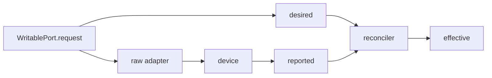
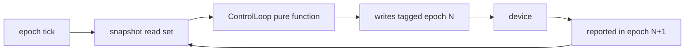
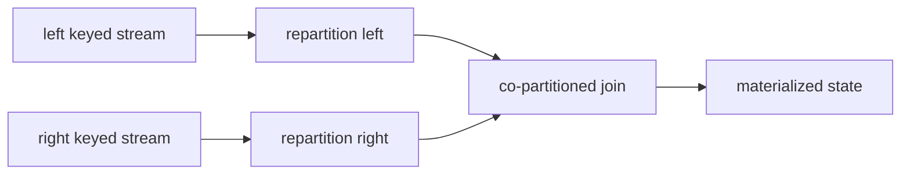

# RFC 0001 — WireGraph Routed Streaming Architecture
Status: Draft  
Date: 2026-04-04  
Audience: runtime, firmware, tooling, and application developers

## 0. Revision notes from review

This revision makes nine material changes relative to the prior draft.

1. **Namespace-first routing.** A stream now lives inside a typed namespace and carries its own audit trail, lineage, and ownership. A stream is no longer “just a topic”; it is a self-contained route.
2. **Explicit read/write types.** The API is now centered on `ReadablePort[T]`, `WritablePort[T]`, and `WriteBinding[ReqT, ReportedT, EffectiveT]`. The prior generic `CommandPort` naming was too narrow.
3. **`Controller` renamed to `ControlLoop`.** The old term was underspecified. The new type is a narrow scheduling primitive for closed read/write loops with epoch boundaries.
4. **Metadata and payload are separate planes.** The wire model now distinguishes `ClosedEnvelope` metadata from payload bytes. `OpenedEnvelope[T]` is defined as a demand-driven join of metadata and payload.
5. **Wire format standardized on Protobuf.** This RFC now includes a concrete Protobuf schema appendix with comments on every field and object-first identifiers instead of ad hoc strings.
6. **Taints made first-class and compositional.** Events and streams now carry vector taints across time, order, delivery, determinism, scheduling, trust, and coherence domains.
7. **Cross-partition joins fully specified.** Repartition, broadcast mirror, lookup, and illegal all-to-all joins are now distinct cases with explicit planner rules.
8. **Query plane modeled as streams.** Introspection is no longer magical or side-channel only. Query requests and responses are themselves typed ports and streams.
9. **Link classes reduced.** The supported transport set is now intentionally smaller and closer to the stated product needs.

## 1. Abstract

WireGraph is a batteries-included streaming architecture for embedded devices, edge runtimes, and multi-process sensor meshes.

It is designed for systems that must simultaneously handle:

- raw hardware telemetry from serial, BLE, radio, USB, shared memory, and IP transports,
- logical derived streams and materialized state,
- explicit write paths back into devices,
- bulk media payloads such as audio, video, and LiDAR,
- deterministic or replayable stateful processing where feasible,
- real-time debugging and third-party consumption.

The central design decision is this:

> The public primitive is **not** a naked observable.  
> The public primitive is a **typed route-bound port inside an explicit graph**.

This RFC intentionally makes several unconventional choices:

- streams define typed namespaces and own audit trails,
- the core API exposes `ReadablePort` and `WritablePort`, not free-form topics,
- metadata and payload are separate planes,
- write coherence is modeled through shadow streams under the write namespace,
- determinism is tracked as taint rather than assumed,
- scheduling is constrained by epoch guards and compile-time graph validation,
- strings are not accepted as identifiers in the typed runtime API.

The goal is not to imitate every existing stream processor. The goal is to build a system that is unusually hard to misuse for embedded sensor workloads.

## 2. Normative language

The key words **MUST**, **MUST NOT**, **REQUIRED**, **SHALL**, **SHALL NOT**, **SHOULD**, **SHOULD NOT**, **RECOMMENDED**, **NOT RECOMMENDED**, **MAY**, and **OPTIONAL** in this document are to be interpreted as normative requirements.

## 3. Goals

WireGraph MUST:

1. provide a common runtime and firmware-facing framework for devices speaking serial, BLE, radio, USB-CDC, shared memory, TCP, and UDP;
2. represent raw and logical streams coherently, including bulk media streams;
3. support explicit write-back paths and closed read/write loops;
4. expose enough structured state for real-time debugging and replay tooling;
5. make retry, filtering, rate matching, backpressure, and overflow policy first-class;
6. support windows, aggregations, and joins;
7. make middleware composition straightforward;
8. support linking streams across runtime and network boundaries;
9. make common scheduling and out-of-order bugs difficult to express;
10. support third-party read/query access without breaking internal invariants.

WireGraph SHOULD:

1. feel natural to Python developers who like Rx-style composition or async iterators;
2. preserve enough semantic structure that lower-level runtimes can optimize hot paths;
3. support a firmware-lite profile on constrained devices and a fuller runtime on edge nodes.

## 4. Non-goals

WireGraph is not:

- a visual patchbay UI in v1,
- a universal replacement for message brokers,
- a promise of exactly-once semantics across every link class,
- a mandate that every temporary computation be globally discoverable,
- a hidden actor framework.

Mailboxes are supported, but the architecture is not mailbox-first. Actors may be one implementation strategy, not the semantic center.

## 5. Design principles

### 5.1 Namespace-first streams

Every stream belongs to a **namespace** that defines ownership, visibility, lineage, and audit scope. A namespace is not cosmetic naming. It is how the runtime answers:

- who produced this,
- which process instance emitted it,
- what transform derived it,
- who consumed it,
- which writes influenced it,
- what taints it carries,
- whether it is public, private, replayable, or ephemeral.

A route without a namespace is invalid.

### 5.2 Object-first API

The typed API MUST NOT accept arbitrary strings for routes, schemas, lateness, durations, profiles, shadow bindings, ack streams, or timeouts.

The following MAY accept textual forms:

- CLI tools,
- config files,
- wire-level query requests from external clients,
- debug console input.

Those textual forms MUST be parsed into typed objects before graph compilation or execution.

### 5.3 Read and write are distinct surfaces

The API MUST expose `ReadablePort[T]` and `WritablePort[T]` explicitly. A semantic channel that is both written and observed MUST be represented as a bundle, not as one ambiguous “duplex topic”.

### 5.4 Metadata and payload are different planes

Routing, filtering, ordering, taint propagation, debugging, and most query-plane operations SHOULD operate on metadata alone. Payload opening SHOULD be demand-driven.

### 5.5 Determinism is tracked, not assumed

A stream is assumed untainted only until a producer or operator marks otherwise. Taints MUST propagate by rule, and operators MAY only clear taints when they can prove repair.

### 5.6 Scheduling is explicit

Scheduler boundaries, buffering, and loop guards MUST be explicit graph constructs, not incidental side effects of implementation details.

### 5.7 Handle-oriented ergonomics

The public API SHOULD behave more like a handle API than a topic-string API.

- route lookup resolves a typed `RouteRef` or `PortRef`;
- graph wiring passes typed handles, not free-form names;
- aliasing of handles MUST be explicit and inspectable;
- execution ordering contexts SHOULD also be represented by typed `LaneRef` objects.

This is intentional. WireGraph borrows from two proven handle models:

- an ordered execution context should be a first-class object, not a name copied into every operation;
- lookup and use should be separate, so that a resolved handle carries capability and lifetime semantics.

WireGraph therefore treats routes, write bindings, mailboxes, and execution lanes as object handles first and display names second.

## 6. Core vocabulary and object model

### 6.1 Identity objects

WireGraph defines the following identifier objects as first-class primitives:

- `NamespaceRef`
- `RouteRef[T]`
- `ProducerRef`
- `RuntimeRef`
- `SchemaRef[T]`
- `PortRef[T]`
- `LaneRef`
- `MailboxRef`
- `LifecycleBindingRef`
- `PartitionKey`
- `ClockDomainRef`
- `ProfileRef`
- `WindowSpec`
- `JoinSpec`
- `LatenessSpec`
- `TimeoutSpec`
- `RetryPolicyRef`
- `PayloadRef`
- `QueryRef`

These objects MAY be generated from Protobuf descriptors, codegen registries, or static modules. The runtime API SHOULD prefer generated symbols such as `Ports.Read.Raw.ImuLeft.Accel.V1` over late-bound string names.

### 6.2 Namespace hierarchy

The canonical route hierarchy is a structured key, not a flat string. Its conceptual fields are:

```text
(plane, layer, owner, family, stream, variant, version)
```

Its recommended diagnostic display form is:

```text
<plane>.<layer>.<owner>.<family>.<stream>.<variant>.<version>
```

Where:

- `plane` is one of `read`, `write`, `state`, `query`, `debug`;
- `layer` is one of `raw`, `logical`, `shadow`, `bulk`, `internal`, `ephemeral`;
- `owner` identifies device, transform, app, runtime, or lifecycle supervisor ownership;
- `family` groups related channels such as `imu`, `motor`, `mailbox`, or `catalog`;
- `stream` names the semantic stream object;
- `variant` distinguishes `meta`, `payload`, `request`, `desired`, `reported`, `effective`, `ack`, and similar surfaces;
- `version` is a typed schema/version object and SHOULD be the leaf.

This display form is for diagnostics. The runtime API SHALL consume `RouteRef[T]`, not text.

### 6.2.1 Recommended generated symbol order

Generated symbols SHOULD be ordered broad-to-narrow for autocomplete and discoverability. The preferred shape is:

```python
Ports.Read.Raw.ImuLeft.Accel.V1
```

The following shape is NOT RECOMMENDED as a primary API:

```python
AccelV1.ImuLeft.Raw.Read
```

Version SHOULD be the leaf, not the root. A compact device-first alias MAY exist for logs or dashboards, but it MUST be derived from the structured route key and MUST NOT replace the canonical object identity.

### 6.3 Route exposure like HTTP routes

Namespaces and routes SHOULD be exposed similarly to HTTP routers:

- a `NamespaceRef` is analogous to a mounted router with defaults and middleware,
- a `RouteTemplate[T]` is analogous to a route pattern,
- a `RouteRef[T]` is a bound route instance,
- a `PortRef[T]` binds a route to a direction and schema,
- the registry enumerates mounted namespaces, templates, and bound instances.

This makes the graph prescriptive about exposure and wiring rather than merely descriptive.

### 6.4 Port types

`PortRef[T]` is an addressable descriptor. It has no read or write behavior on its own.

`ReadablePort[T]` provides:

- `meta() -> Stream[ClosedEnvelope]`
- `open() -> Stream[OpenedEnvelope[T]]`
- `latest() -> StateView[ClosedEnvelope | None]`
- `describe() -> PortDescriptor[T]`

`WritablePort[T]` provides:

- `write(intent: WriteIntent[T]) -> WriteTicket`
- `describe() -> PortDescriptor[T]`

`WriteBinding[ReqT, ReportedT, EffectiveT]` bundles:

- `request: WritablePort[ReqT]`
- `desired: ReadablePort[ReqT]`
- `reported: ReadablePort[ReportedT]`
- `effective: ReadablePort[EffectiveT]`
- optional `ack: ReadablePort[WriteAck]`

`Mailbox[T]` is a logical queue boundary expressed as:

- `ingress: WritablePort[T]`
- `egress: ReadablePort[T]`
- explicit capacity, ordering, overflow, durability, and credit policy

`EphemeralPort[T]` is a short-lived route whose lifetime is scoped to a parent graph, trace, or operator instance.

### 6.5 Why `ReadablePort` and `WritablePort` are explicit

A single type called `Port` is too weak. It invites the worst ambiguity:

- Is this something I can write to?
- Is it observable state or intent?
- Does reading it change delivery demand?
- Is it a logical command or physical actuator edge?

WireGraph therefore uses `PortRef` for addressing and `ReadablePort`/`WritablePort` for capability.

### 6.5.1 `graph.connect(source, sink)` resolution rules

Developer ergonomics matters. The zero-config path SHOULD be:

```python
graph.connect(source, sink)
```

Resolution rules:

- if `source` is a `Mailbox`, the runtime MUST connect from `source.egress`;
- if `sink` is a `Mailbox`, the runtime MUST connect to `sink.ingress`;
- explicit endpoint selection always overrides inference;
- type compatibility MUST still be validated at compile time.

Descriptor defaults MUST compose in this order:

1. explicit edge override,
2. sink requirements,
3. source defaults,
4. mailbox or lane defaults if present,
5. graph defaults.

The explicit forms (`mailbox.ingress`, `mailbox.egress`) MUST remain available for callers that want no inference at all.

### 6.6 Producer and runtime identity

`ProducerRef` is a first-class primitive and MUST be present on all events.

A producer is the semantic owner of emitted data. Examples:

- a hardware device,
- a firmware sensor agent,
- a transform operator,
- a control loop,
- a mailbox,
- a query service.

`RuntimeRef` identifies the concrete runtime instance that emitted or re-emitted the record.

These are not the same thing.

Examples:

- a left IMU device is the `ProducerRef`;
- the edge runtime process attached over UART is the `RuntimeRef` that emitted the decoded record into the graph.

## 7. Descriptor model

The prior draft flattened too many concerns into one giant descriptor. This RFC groups settings into explicit buckets.

```python
@dataclass(frozen=True)
class PortDescriptor[T]:
    identity: IdentityBlock
    schema: SchemaBlock[T]
    time: TimeBlock
    ordering: OrderingBlock
    flow: FlowBlock
    retention: RetentionBlock
    security: SecurityBlock
    visibility: VisibilityBlock
    environment: EnvironmentBlock
    debug: DebugBlock
```

### 7.1 Identity block

The identity block MUST include:

- `route_ref`
- `namespace_ref`
- `producer_ref`
- `owning_runtime_kind`
- `stream_family`
- `stream_variant`
- `aliases`
- `human_description`

### 7.2 Schema block

The schema block MUST include:

- `schema_ref`
- `payload_kind`
- `codec_ref`
- `structured_payload_type`
- `payload_open_policy`

### 7.3 Time block

The time block MUST include:

- `clock_domain`
- `event_time_policy`
- `processing_time_allowed`
- `watermark_policy`
- `control_epoch_policy`
- `ttl_policy`

### 7.4 Ordering block

The ordering block MUST include:

- `partition_spec`
- `sequence_source_kind`
- `resequence_policy`
- `dedupe_policy`
- `causality_policy`

### 7.5 Flow block

The flow block MUST include:

- `backpressure_policy`
- `credit_class`
- `mailbox_policy`
- `async_boundary_kind`
- `overflow_policy`

### 7.6 Retention block

The retention block MUST include:

- `latest_replay_policy`
- `durability_class`
- `replay_window`
- `payload_retention_policy`

### 7.7 Security block

The security block MUST include:

- `read_capabilities`
- `write_capabilities`
- `payload_open_capabilities`
- `redaction_policy`
- `integrity_policy`

### 7.8 Visibility block

The visibility block MUST include:

- `private_or_exported`
- `third_party_subscription_allowed`
- `query_plane_visibility`
- `debug_plane_visibility`

### 7.9 Environment block

The environment block MUST include:

- `locality`
- `transport_preferences`
- `device_class`
- `resource_class`
- `ephemeral_scope` if any

### 7.10 Debug block

The debug block MUST include:

- `audit_enabled`
- `trace_enabled`
- `metrics_enabled`
- `payload_peek_allowed`
- `explain_enabled`

## 8. Envelope, metadata, and payload model

### 8.1 Closed and opened envelopes

This RFC distinguishes between three related concepts:

1. **`ClosedEnvelope`**  
   Metadata only. It contains the event header, identity, timing, taints, and a `PayloadRef`, but not the payload bytes themselves.

2. **`PayloadChunk` / `PayloadLease`**  
   The payload plane, addressed by `PayloadRef`.

3. **`OpenedEnvelope[T]`**  
   A typed SDK construct formed by joining `ClosedEnvelope` metadata with payload bytes or decoded structured payload on demand.

This distinction is REQUIRED.

### 8.2 Why the split matters

The split is not an optimization flourish. It changes the ergonomics and correctness model:

- packet routing can happen without decoding payloads,
- metadata-only filters can run cheaply,
- debug tooling can inspect lineage without materializing bulk bytes,
- consumers that do not need payloads do not accidentally create payload demand,
- audio/video/LiDAR streams can stay largely in a bulk plane,
- payload retention and replay can differ from metadata retention.

### 8.3 Formal model

Let:

- `M(route)` be the metadata stream for a route,
- `P(route)` be the payload stream keyed by `payload_id`.

Then:

- `ClosedEnvelope` is an element of `M(route)`.
- `OpenedEnvelope[T]` is the result of a demand-driven local join:

```text
OpenedEnvelope[T] := M(route) JOIN P(route) ON payload_ref.id
```

This join is consumer-local and MAY be lazy.

### 8.4 Lazy payload demand

The runtime MUST distinguish metadata demand from payload demand.

If there are zero downstream consumers requiring opened payloads:

- the runtime MUST NOT decode or deserialize payload bytes;
- the runtime SHOULD avoid copying payload bytes;
- the runtime SHOULD avoid fetching payload bytes from the underlying transport where the link permits lazy fetch;
- if the link does not permit lazy fetch, the runtime MAY still need to physically drain bytes to preserve framing, but it MUST be allowed to discard them after metadata extraction.

This is a critical nuance for bulk sensor streams.

### 8.4.1 Lazy payload producers

A writer that emits payload-bearing events SHOULD be allowed to provide a `LazyPayloadSource` rather than eagerly materialized bytes.

A `LazyPayloadSource` is conceptually:

```python
class LazyPayloadSource:
    def open(self) -> AsyncIterator[bytes]: ...
```

Rules:

- the runtime MUST invoke the lazy source only when there is payload demand downstream;
- metadata publication MUST NOT require opening the lazy source;
- if the payload is never opened, the lazy source SHOULD never be consumed;
- if the payload is accepted by a transport that cannot delay payload transfer, the adapter MAY consume the source eagerly, but that eagerness MUST be attributed to the link, not to the logical route.

This distinction lets metadata flow cheaply while still supporting on-demand payload reads and writes.

### 8.5 Envelope metadata fields

Every metadata record MUST include:

- route identity,
- producer identity,
- runtime emitter identity,
- source-local sequence number,
- optional link-local sequence number,
- device time,
- ingest time,
- logical time,
- clock domain,
- partition key if any,
- causality identity,
- correlation identity,
- trace identity,
- control epoch if any,
- taint vector,
- schedule guards,
- payload reference,
- QoS class,
- security labels.

The concrete wire schema is in Appendix A.

### 8.6 Causality versus correlation

These two identifiers are intentionally distinct.

**`CorrelationId`** groups records that belong to the same higher-level request, session, transaction, or job. Correlation is for grouping.

Examples:

- all writes issued by calibration run `Run42`,
- all query responses belonging to one external dashboard request,
- all packets in one firmware upload session.

**`CausalityId`** identifies a cause-and-effect chain.

Examples:

- accelerometer sample `A` caused control output `B`,
- write `B` caused device report `C`,
- report `C` caused logical state update `D`.

One correlation may contain many causality chains. A causality chain SHOULD belong to at most one correlation.

### 8.7 Route-local audit trail

Every route MUST be able to answer, via the debug/query plane:

- who produced recent events,
- which transforms published into the route,
- which subscribers currently consume the route,
- which writes targeted related write bindings,
- which taints were introduced or cleared.

A route is therefore also an audit scope.

## 9. Read and write namespace model

The top-level namespace planes are:

- `read.*`
- `write.*`
- `state.*`
- `query.*`
- `debug.*`

Within `read.*` and `write.*`, layers include:

- `raw`
- `logical`
- `shadow`
- `bulk`
- `ephemeral`
- `internal`

### 9.1 Read plane

The read plane contains observed or derived values.

Examples:

- `read.raw.imu.left.accel.meta`
- `read.logical.pose.estimate.meta`
- `read.bulk.lidar.left.frame.meta`

### 9.2 Write plane

The write plane contains command or intent surfaces.

Examples:

- `write.raw.motor.left.pwm.request`
- `write.logical.light.brightness.request`

Every write route MUST also define shadow semantics unless explicitly marked fire-and-forget and unsafe.

### 9.3 Shadow namespace under write

Every `WritablePort` SHOULD be associated with a shadow subtree:

- `write.<layer>.<...>.desired`
- `write.<layer>.<...>.reported`
- `write.<layer>.<...>.effective`
- optional `write.<layer>.<...>.ack`

These are not decorative names. They are the coherence contract.

### 9.4 Coherence rules for read/write channels

A semantic channel that is both written and consumed MUST NOT collapse request and observed state into one route.

Instead:

- requests flow through `WritablePort[ReqT]`,
- intent is reflected into `desired`,
- device or adapter observation updates `reported`,
- reconciled truth is published as `effective`.

Consumers MUST decide which of these they mean. Most business logic SHOULD read `effective`. Audit and UI MAY read all three.

### 9.5 Example: logical brightness command

Suppose an app wants “brightness 0.8” and the device uses PWM duty cycle.

The routes are:

- `write.logical.light.brightness.request` with payload `LogicalBrightness`
- `write.logical.light.brightness.desired` with payload `LogicalBrightness`
- `write.raw.light.pwm.request` with payload `DutyCycle`
- `write.raw.light.pwm.reported` with payload `DutyCycle`
- `write.logical.light.brightness.effective` with payload `LogicalBrightness`

The logical write adapter translates logical request to raw device request and also translates raw report back to logical effective state.

## 10. Time model, taints, and scheduling guards

This section intentionally bundles time, processing time, clock domains, scheduling gates, and taint semantics rather than scattering them.

### 10.1 Time kinds

WireGraph distinguishes:

- **device time** — from device or sensor clock,
- **ingest time** — assigned when the runtime first accepts the record,
- **event/logical time** — used for stream semantics such as windows and joins,
- **processing time** — wall-clock/runtime execution time,
- **control epoch time** — discrete loop boundary time for closed feedback systems,
- **TTL / expiry time** — scheduling and retention deadline information.

### 10.2 Clock domains

Every timestamp MUST be interpreted within a `ClockDomainRef`.

Two timestamps MAY have the same numeric value and be incomparable if they come from different clock domains.

Mixing clock domains requires an explicit operator:

- `PassThroughClock` for identical domains,
- `AffineClockRepair` when drift is modeled,
- `WatermarkAlignment` for event-time alignment,
- `UnsafeClockMerge` only by explicit opt-in.

### 10.3 Watermarks

Event-time operators MUST consume watermarks or equivalent progress signals. Processing-time operators MAY ignore watermarks but MUST taint downstream determinism accordingly.

### 10.4 Taint domains

Taints are vector-valued. A single linear taint scale is too weak.

WireGraph defines at minimum these taint domains:

- `TimeTaint`
- `OrderTaint`
- `DeliveryTaint`
- `DeterminismTaint`
- `SchedulingTaint`
- `TrustTaint`
- `CoherenceTaint`

#### 10.4.1 Time taints

Examples:

- `TIME_PERFECT`
- `TIME_ESTIMATED`
- `TIME_REPAIRED`
- `TIME_PROCESSING`
- `TIME_UNKNOWN`

#### 10.4.2 Order taints

Examples:

- `ORDER_STRICT`
- `ORDER_KEYED`
- `ORDER_RESEQUENCED`
- `ORDER_POSSIBLY_OUT_OF_ORDER`

#### 10.4.3 Delivery taints

Examples:

- `DELIVERY_COMPLETE`
- `DELIVERY_SAMPLED`
- `DELIVERY_COALESCED`
- `DELIVERY_DROPPED`
- `DELIVERY_DUPLICATED`

#### 10.4.4 Determinism taints

Examples:

- `DET_DETERMINISTIC`
- `DET_SEEDED_ENTROPY`
- `DET_PROCESSING_CLOCK`
- `DET_EXTERNAL_LOOKUP`
- `DET_NONREPLAYABLE`

#### 10.4.5 Scheduling taints

Examples:

- `SCHED_READY`
- `SCHED_GATED`
- `SCHED_EXPIRED`

#### 10.4.6 Trust taints

Examples:

- `TRUST_VERIFIED`
- `TRUST_UNVERIFIED`
- `TRUST_TAMPER_SUSPECT`

#### 10.4.7 Coherence taints

Examples:

- `COHERENCE_STABLE`
- `COHERENCE_WRITE_PENDING`
- `COHERENCE_ECHO_UNMATCHED`
- `COHERENCE_STALE_REPORTED`

### 10.5 Taint inheritance and composition

By default, a newly produced event is assumed untainted. Producers SHOULD add taints at the first point uncertainty or loss enters the system.

For each taint domain, output taints are computed as:

```text
output = join(all input taints in domain) 
         minus proven repairs
         plus operator-added taints
```

Rules:

1. Taints are monotonic unless a repair operator explicitly clears one.
2. A repair operator MUST declare which taint it can clear and under which proof.
3. Some taints are absorbing. For example `DET_NONREPLAYABLE` cannot be downgraded by downstream logic.
4. Stream-level taints are the declared default or upper bound for the stream. Event-level taints are exact for that event.
5. A stream MAY contain both clean and tainted events; the stream descriptor SHALL expose the declared upper bound, not pretend the stream is globally perfect.

### 10.6 Repair operators

Examples of legitimate repairs:

- `resequence(within=WindowSpec(...))` MAY clear `ORDER_POSSIBLY_OUT_OF_ORDER` and add `ORDER_RESEQUENCED`,
- `clock_repair(model=...)` MAY clear `TIME_UNKNOWN` to `TIME_REPAIRED`,
- `dedupe(by=...)` MAY clear `DELIVERY_DUPLICATED` if the dedupe proof is sound.

### 10.7 Schedule guards

A taint alone is descriptive. A **schedule guard** is prescriptive.

`ScheduleGuard` SHALL express one or more dispatch conditions, such as:

- not before monotonic time `t`,
- not before control epoch `n`,
- not before watermark `w`,
- only when credit class `c` is available,
- only when ack on route `r` has been observed,
- expires after TTL `d`.

A `ScheduleRouter` operator consumes guarded events and releases or expires them.

The runtime MUST NOT implement this as a busy loop. It SHOULD use timer wheels, condition variables, async waits, or equivalent. A guarded event with `SCHED_GATED` plus `expires_at` is the canonical "do not schedule yet, and drop after TTL" mechanism.

### 10.8 Control epoch time

The previous draft’s `Controller` term was too vague. This RFC replaces it with **`ControlLoop`**.

A `ControlLoop` is a special operator for closed feedback systems. It is not a general-purpose actor. It exists to make same-tick write/read bugs difficult. In practical terms, it is a scheduled snapshot barrier plus a pure step function plus guarded write emission.

A `ControlLoop` MUST define:

- a read set,
- a write set,
- an epoch source,
- a snapshot policy,
- a latency/expiry policy.

Execution model for epoch `N`:

1. collect the permitted read snapshot for epoch `N`,
2. freeze that snapshot,
3. run a pure control function against it,
4. emit writes tagged with `control_epoch = N`,
5. ensure those writes cannot be re-consumed by the same loop in epoch `N`,
6. observe resulting reports in epoch `N+1` or later.

This may be enforced either by snapshot sealing inside the loop or by inserting `ScheduleGuard(not_before_epoch = N+1)` on return paths. Both are equivalent from the semantic point of view.

### 10.9 Ephemeral streams

The runtime MUST support ephemeral streams.

An ephemeral stream:

- is created inside a running application or operator,
- has an explicit owner and TTL,
- defaults to private visibility,
- defaults to non-replayable retention,
- MAY be promoted to a normal route explicitly.

Ephemeral streams are valid for things like:

- per-request derived traces,
- temporary mailbox routes,
- event-local entropy derivation,
- short-lived speculative joins.

Using ephemeral entropy MUST taint determinism unless the entropy source is seeded and recorded.

## 11. Write model, feedback loops, and shadow semantics

### 11.1 Writes are explicit

Only `WritablePort` instances accept writes.

`ReadablePort` instances MUST reject write attempts.

### 11.1.1 Device lifecycle as a write binding

Device lifecycle SHOULD be modeled through a specialized `LifecycleBinding`, not through a side API that bypasses the graph.

A `LifecycleBinding` is a `WriteBinding[LifecycleIntent, LifecycleObservation, LifecycleObservation]` plus optional health and event routes. It models connect, disconnect, retry, discovery, quiesce, and failure handling as graph-visible state transitions.

The preferred lifecycle request is declarative. Callers SHOULD write a target such as `CONNECTED`, `DISCOVERABLE`, `DETACHED`, or `QUIESCED`, and the lifecycle supervisor SHOULD reconcile toward that target. One-shot imperative requests such as `ReconnectNow` MAY exist, but they MUST still emit normal desired, reported, and effective lifecycle transitions so that retries and failures remain auditable.

Retry and backoff policy MUST be an object, such as `RetryPolicyRef`, not a string or ad hoc callback. The policy MAY be attached to the binding descriptor or overridden per request.

A typical lifecycle route family is:

- `write.raw.device.imu_left.lifecycle.request`
- `write.raw.device.imu_left.lifecycle.desired`
- `write.raw.device.imu_left.lifecycle.reported`
- `write.raw.device.imu_left.lifecycle.effective`
- `read.internal.device.imu_left.lifecycle.event`

This makes connect, retry-connect, backoff, and terminal failure part of the normal route model rather than invisible runtime behavior.

### 11.2 Every write becomes observable state

Every write SHOULD update at least `desired` state. This makes the system observable even before the device confirms application.

### 11.3 Shadow semantics

The meanings are:

- **desired** — what the runtime currently intends,
- **reported** — what the device or low-level adapter most recently reported,
- **effective** — the resolved truth the rest of the system should generally consume.

`effective` MAY equal `reported`. It MAY also be a reconciliation between `desired`, `reported`, and policy.

Examples:

- if the device has not yet reported the requested state, `effective` MAY remain at old value and carry `COHERENCE_WRITE_PENDING`;
- if reported state is physically clamped by hardware limits, `effective` SHOULD reflect the clamped value.

### 11.4 Fire-and-forget writes

Fire-and-forget writes are allowed only by explicit descriptor policy. They MUST taint coherence accordingly because the system cannot confirm application.

### 11.5 Write-back loops

A write-back loop exists when a device or runtime both consumes and produces state on the same semantic concept.

This RFC distinguishes:

- **internal observational loops** inside the device,
- **external command loops** driven by the graph.

Strongly connected components involving write ports and observed read ports MUST include one of:

- a `ControlLoop`,
- a mailbox or queue boundary,
- an explicit delay/epoch guard,
- a device-side ack boundary.

Otherwise the graph compiler MUST reject the loop.

### 11.6 Examples of closed-loop coherence

#### Example A: simple counter

A logical counter variable with increment commands:

- `write.logical.counter.increment.request`
- `write.logical.counter.value.desired`
- `write.logical.counter.value.reported`
- `write.logical.counter.value.effective`

If the device applies the increment and reports back later, the loop is closed through `effective`, not by reading the request stream as if it were state.

#### Example B: PWM motor speed

- request payload says “500 rpm”
- desired becomes 500 rpm
- raw write emits PWM duty
- device reports 450 rpm due to load
- effective becomes 450 rpm and MAY carry no taint if that is the truthful applied state

## 12. Execution model

### 12.1 Single semantic scheduler

Each runtime has one semantic scheduler. Operators MAY execute on different executors under the hood, but their scheduling boundaries MUST be explicit in the graph.

### 12.2 Async boundaries

The following constructs introduce async or scheduling boundaries:

- `Mailbox`
- `Bridge`
- `spawn(...)`
- `schedule_router(...)`
- `repartition(...)`
- `payload_open(...)` if it uses an external payload plane
- `query_bridge(...)`

A normal transform MUST NOT silently hop schedulers.

### 12.3 Mailboxes as logical streams

A mailbox is not greenfield. It is a configured queue-like bridge that already exists in many systems.

A `Mailbox[T]` is defined by:

- ingress `WritablePort[T]`
- egress `ReadablePort[T]`
- capacity
- consumer cardinality
- ordering policy
- overflow policy
- durability class
- ack policy
- scheduling boundary flag
- credit class

A mailbox MAY be implemented by:

- an actor mailbox,
- an asyncio queue,
- an MPSC channel,
- a bounded ring buffer,
- a durable log-backed queue.

Semantically, it is still a logical stream boundary.

### 12.3.1 Many-to-many mailbox semantics

A mailbox is not merely "a queue". In the many-to-many case it is the composition of:

- fan-in from one or more producers,
- arbitration across submitted items,
- one or more consumer groups,
- a delivery rule for each consumer group,
- ack and redelivery policy if delivery is unique rather than replicated.

The mailbox descriptor MUST declare its delivery model explicitly.

### 12.3.2 Mailbox delivery models

The built-in delivery models SHOULD include:

- `MPSC_SERIAL` — many producers, one consumer, preserving per-producer order and mailbox arbitration order;
- `MPMC_UNIQUE` — many producers, many consumers, where each item is leased to exactly one consumer in a consumer group;
- `MPMC_REPLICATED` — many producers, many consumers, where each consumer group receives its own copy;
- `KEY_AFFINE` — many producers, many consumers, where items are assigned by key and per-key order is preserved.

If every consumer must receive every message and buffering is not the main concern, `Broadcast` or `Replicate` SHOULD usually be preferred over a mailbox.

### 12.3.3 Producer fairness and consumer groups

A mailbox with many producers MUST declare arbitration policy. Supported policies SHOULD include:

- round-robin by producer,
- weighted fair,
- strict priority stable,
- key-affine.

For `MPMC_UNIQUE`, the mailbox MUST also declare:

- consumer-group membership,
- lease timeout,
- ack requirement,
- redelivery policy,
- poison-message policy.

Per-producer order MUST be preserved unless the descriptor explicitly opts into unordered behavior.

### 12.3.4 Ergonomic mailbox wiring

The simple form:

```python
graph.connect(source, mailbox)
graph.connect(mailbox, sink)
```

MUST be supported and MUST resolve to mailbox ingress and egress automatically. The explicit forms remain available:

```python
graph.connect(source, mailbox.ingress)
graph.connect(mailbox.egress, sink)
```

This keeps the common case short without removing control over ordering, overflow, credits, or scheduling boundaries.

### 12.4 Mailbox ordering policies

Supported mailbox ordering policies SHOULD include:

- `FIFO`
- `PRIORITY_STABLE`
- `WEIGHTED_FAIR`
- `ROUND_ROBIN_BY_PRODUCER`
- `KEYED_FIFO`
- `LATEST_ONLY`

`UNORDERED` mailboxes MAY exist but MUST taint order.

### 12.5 Mailbox overflow policies

Supported overflow policies SHOULD include:

- `BLOCK`
- `DROP_OLDEST`
- `DROP_NEWEST`
- `COALESCE_LATEST`
- `DEADLINE_DROP`
- `SPILL_TO_STORE`

Unbounded mailboxes MUST be rejected by default unless marked unsafe.

## 13. Backpressure and credit-based flow control

Backpressure is REQUIRED on every edge. An edge that “just buffers” is incomplete.

### 13.1 Edge pressure policies

Every edge MUST declare one policy:

- `BLOCK`
- `COALESCE_LATEST`
- `DROP_OLDEST`
- `DROP_NEWEST`
- `SAMPLE`
- `PRIORITY_QUEUE`
- `SPILL_TO_STORE`
- `DEADLINE_DROP`

### 13.2 Credit model overview

The canonical model is credit-based:

- downstream grants credits,
- upstream spends credits,
- no credit means no emit unless the edge policy explicitly allows loss or coalescing.

Credits may be counted in:

- envelopes,
- metadata records,
- payload bytes,
- decoded payload opens,
- window slots.

### 13.2.1 Credit authority

Every credit class MUST have an authority:

- a direct downstream consumer,
- a mailbox manager,
- a bridge adapter,
- a fanout coordinator,
- a query/session manager.

### 13.2.2 Credit units

Credit units MUST be explicit and typed.

Examples:

- `EnvelopeCredit`
- `ByteCredit`
- `OpenPayloadCredit`
- `WindowStateCredit`

A bulk payload stream SHOULD use byte credits, not just message-count credits.

### 13.2.3 Initial credit grants

Every connection MUST define bootstrap credits.

Defaults SHOULD be conservative for command paths and bulk payload opens.

### 13.2.4 Credit replenishment

Credits MAY be replenished:

- per consume,
- per ack,
- per batch,
- per timer tick,
- per watermark advancement.

The replenishment policy MUST be visible in the descriptor.

### 13.2.5 Credit reservation

Operators MAY reserve credits ahead of time for:

- payload open,
- cross-partition join state,
- multi-sink fanout,
- query response streaming,
- control-path priority handling.

Reservations MUST be bounded and observable.

### 13.2.6 Priority lanes

Credit classes SHOULD support priority lanes:

- control,
- metadata,
- payload,
- debug.

Control credits SHOULD NOT starve completely behind payload credits.

### 13.2.7 Credit expiry and revocation

Credits MAY expire or be revoked on:

- connection loss,
- session expiry,
- TTL expiry,
- topology reconfiguration.

Revocation MUST surface in debug metrics.

### 13.2.8 Deadlock avoidance

The runtime MUST avoid credit deadlocks.

At minimum, it SHOULD support:

- minimum reserved control credits,
- cyclic-dependency detection for credit waits,
- bounded mailboxes in feedback loops,
- explicit unsafe opt-in for fully cyclic backpressure.

### 13.2.9 Observability

The debug plane MUST expose:

- current credits,
- credit debt,
- replenishment rate,
- blocked senders,
- coalesced/dropped counts,
- average wait time,
- largest outstanding reservation.

### 13.2.10 Credit translation at bridges and fanout nodes

A bridge, fanout, or mailbox boundary that sits between producer and consumer credit domains MUST translate credits explicitly.

Rules:

- a one-to-one bridge MAY forward credits directly;
- a fanout MUST define whether upstream credit is the minimum of downstream credits, a reserved control slice plus shared pool, or another declared policy;
- a lossy branch MUST NOT silently consume credits intended for a lossless branch;
- credit translation state MUST be visible in the debug plane.

### 13.2.11 Payload-open credits

Metadata delivery and payload opening are distinct demand surfaces.

Rules:

- metadata credits MUST NOT imply permission to open payload bytes;
- payload opening SHOULD consume `OpenPayloadCredit`, `ByteCredit`, or both;
- a consumer that only watches metadata MUST be unable to force bulk payload transfer accidentally;
- credit starvation on payload-open MUST NOT starve control-lane metadata traffic.

## 14. Stateful operators, windows, and joins

### 14.1 Stateful operators

The framework SHOULD ship first-class operators for:

- `map`
- `filter`
- `scan`
- `reduce`
- `aggregate`
- `debounce`
- `throttle`
- `hysteresis`
- `dedupe`
- `resequence`
- `sample`
- `window`
- `join`
- `lookup_join`
- `interval_join`
- `stateful_map`
- `materialize`

### 14.2 Materialized state

`state.*` routes are materialized state views. They are readable and queryable but MUST NOT be mutated out-of-band. Mutation MUST happen through the topology that owns them.

### 14.3 Window specification

Every window MUST specify:

- time basis,
- width,
- lateness/grace,
- trigger policy,
- retention policy,
- partition/key basis.

### 14.4 Join classes

Supported join classes:

- local keyed join,
- interval join,
- stream-table lookup join,
- broadcast mirror join,
- repartition join.

All-to-all cross joins MUST be rejected unless explicitly bounded and marked unsafe.

## 15. Cross-partition joins

The prior draft’s sentence “explicit repartition or broadcast” was too weak. This section makes the planner behavior explicit.

### 15.1 Partition prerequisites

Every join input MUST declare:

- its partition key semantics,
- ordering guarantees within partition,
- watermark semantics,
- state retention needs.

### 15.2 Local keyed join

A local keyed join is legal when:

- both sides are keyed on the same semantic key,
- both sides are co-partitioned,
- both sides have compatible ordering/watermark guarantees.

This is the cheapest and preferred form.

### 15.3 Repartition join

A repartition join is legal when:

- one or both sides can be rekeyed deterministically,
- the runtime inserts a visible repartition boundary,
- the boundary has explicit spill/backpressure semantics,
- the resulting partitions are co-located or bridgeable.

The planner MUST surface repartition as an explicit graph node, not an invisible internal detail.

### 15.4 Broadcast mirror join

A broadcast mirror join is legal when:

- one side is sufficiently small or slow-moving,
- broadcast updates are deterministic,
- broadcast updates are order-insensitive or version-gated,
- memory cost is acceptable.

Broadcast mirror updates MUST NOT depend on arrival order across tasks.

### 15.5 Lookup join

A lookup join is legal when:

- the right-hand side is a materialized state view,
- the lookup semantics are versioned or snapshot-consistent,
- nondeterminism from remote lookups is either eliminated or tainted.

### 15.6 Illegal joins

The planner MUST reject:

- cross-product joins with unbounded sides,
- joins on incomparable clock domains without explicit alignment,
- joins on incompatible partition keys without repartition or broadcast mirror,
- joins that would require unbounded state under declared policies.

### 15.7 Skew and hot keys

The runtime SHOULD expose:

- largest partition size,
- hot-key frequency,
- join state per key,
- backpressure attributable to repartition skew.

## 16. Middleware

Middleware is first-class and attaches to routes, edges, or namespaces.

### 16.1 Built-in middleware classes

The initial set SHOULD include:

- codecs and schema evolution,
- validation,
- timestamp repair,
- watermark generation,
- retry with idempotency policy,
- timeout/deadline,
- compression,
- encryption and auth,
- dedupe,
- resequencing,
- drift estimation,
- tracing and metrics,
- persistence and replay,
- redaction,
- rate matching.

### 16.2 Middleware constraints

Middleware MUST:

- preserve envelope identity unless explicitly re-framing,
- preserve or update taints,
- preserve or update causality and correlation,
- declare any async boundary it introduces.

## 17. Transport and link model

The supported v1 link classes are intentionally limited to the stated use cases.

### 17.1 Supported link classes

The runtime SHOULD ship adapters for:

- `InProcessLink`
- `SharedMemoryLink`
- `SerialLink`
- `UsbCdcLink`
- `BleLink`
- `RadioDatagramLink`
- `TcpStreamLink`
- `UdpDatagramLink`

Persistent replay storage is a retention facility, not a transport class.

### 17.2 Link capability model

Each link advertises capabilities:

- ordered
- reliable
- replayable
- zero_copy
- payload_lazy_open
- encrypted
- authenticated
- clock_sync_support
- mtu_bound

The planner MUST either:

- compile directly onto a compatible link,
- insert middleware to raise semantics,
- or reject the binding.

## 18. Mesh primitives

This section defines each mesh primitive as a subsection.

### 18.1 Bridge

A **Bridge** connects ports or runtimes across a link while preserving or adapting semantics.

A bridge MUST declare:

- source route,
- destination route,
- capability translation,
- credit translation,
- taint translation,
- security policy.

### 18.2 Broadcast

A **Broadcast** sends one source stream to all downstream subscribers.

Guarantees:

- per-subscriber ordering depends on the source and link,
- broadcast does not imply identical arrival order across all subscribers,
- broadcast updates used as state MUST be deterministic and order-insensitive.

### 18.3 Tee

A **Tee** duplicates a stream to a side channel without changing the main path.

Common uses:

- debug capture,
- audit logging,
- selective replay.

A tee SHOULD NOT introduce backpressure on the main path unless configured to do so.

### 18.4 Fanout

A **Fanout** duplicates one source into multiple typed destination routes selected at compile time.

Fanout differs from broadcast because destinations are explicit graph edges, not generic subscribers.

### 18.5 Fanin

A **Fanin** merges multiple input streams into one output route.

A fanin MUST declare ordering policy:

- source-priority,
- timestamp order,
- partition merge,
- unsafe arbitrary merge.

### 18.6 Scatter

A **Scatter** partitions one input by key or policy across multiple downstream routes or peers.

Scatter MUST declare the partition function object, not a string lambda.

### 18.7 Gather

A **Gather** collects multiple partitions or shards back into a coordinated stream or materialized state.

Gather MUST declare:

- ordering policy,
- watermark policy,
- state budget,
- skew handling.

### 18.8 Mirror

A **Mirror** maintains a shadow copy of a stream or state view, often for query or locality reasons.

A mirror MAY be lossy only by explicit opt-in.

### 18.9 Replicate

A **Replicate** sends the same stream to multiple peers with explicit ack semantics.

Replication is stronger than fanout because downstream ack policy is part of the primitive.

### 18.10 Quorum

A **Quorum** consumes votes, acks, or observations from multiple peers and emits when a threshold rule is satisfied.

Quorum MUST specify:

- member set,
- threshold,
- timeout,
- tie/duplication handling,
- ordering policy.

### 18.11 Compose, do not hide

All higher-level synchronization primitives SHOULD be composed from these building blocks. The system SHOULD NOT hide consensus, lock-step barriers, or distributed timers behind magical implicit behavior.

## 19. Query plane and debug plane

### 19.1 Query plane as streams

The query plane is itself modeled as typed request/response streams.

Each query service SHOULD expose:

- a request `WritablePort[QueryRequest]`
- a response `ReadablePort[QueryResponse]`

Responses are correlated to requests by `CorrelationId` and requester identity.

The query plane MUST obey the same principles as normal streams:

- typed routes,
- explicit backpressure,
- capability checks,
- auditability,
- optional replay where appropriate.

### 19.2 Why this matters

This avoids a split-brain architecture where the data plane is stream-based but all introspection happens through unrelated ad hoc RPC calls.

### 19.3 Core query commands

The system SHOULD provide typed queries for:

- `CatalogQuery`
- `DescribeRouteQuery`
- `TopologyQuery`
- `LatestQuery`
- `WatchQuery`
- `ReplayQuery`
- `TraceQuery`
- `WatermarkQuery`
- `BufferStatsQuery`
- `CreditStatsQuery`
- `ShadowQuery`
- `SubscribersQuery`
- `WritersQuery`
- `TaintQuery`
- `ValidateGraphQuery`
- `ExplainJoinQuery`
- `OpenPayloadQuery`
- `AuditQuery`

### 19.4 Command semantics

#### 19.4.1 `CatalogQuery`
Returns all visible routes, descriptors, ownership blocks, exposure flags, and shadow bindings.

#### 19.4.2 `DescribeRouteQuery`
Returns the full descriptor and lineage for one route.

#### 19.4.3 `TopologyQuery`
Returns nodes, edges, async boundaries, mailboxes, repartition nodes, and route bindings.

#### 19.4.4 `LatestQuery`
Returns the latest available closed envelope or state view snapshot for a route.

#### 19.4.5 `WatchQuery`
Creates a live subscription according to policy and permissions.

#### 19.4.6 `ReplayQuery`
Returns a bounded replay stream from retained history.

#### 19.4.7 `TraceQuery`
Returns lineage by `TraceId`, `CausalityId`, or `CorrelationId`.

#### 19.4.8 `WatermarkQuery`
Returns current watermark state per route and partition.

#### 19.4.9 `BufferStatsQuery`
Returns queue depths, mailbox states, and overflow counters.

#### 19.4.10 `CreditStatsQuery`
Returns credit balances, reservations, and blocked senders.

#### 19.4.11 `ShadowQuery`
Returns desired, reported, effective, and pending-write state for a write binding.

#### 19.4.12 `SubscribersQuery`
Returns current subscribers and relevant subscription policy metadata.

#### 19.4.13 `WritersQuery`
Returns recent or active writers to a write binding.

#### 19.4.14 `TaintQuery`
Returns stream-level and recent event-level taints with origin and repair notes.

#### 19.4.15 `ValidateGraphQuery`
Runs graph checks and returns violations or warnings.

#### 19.4.16 `ExplainJoinQuery`
Explains join class, partition alignment, state budget, and taint implications.

#### 19.4.17 `OpenPayloadQuery`
Requests payload opening for a retained record, subject to capability and retention policy.

#### 19.4.18 `AuditQuery`
Returns audit events for a namespace or route.

### 19.5 Debug plane streams

The debug plane SHOULD expose well-known routes for:

- audit events,
- metrics events,
- taint changes,
- write acks,
- replay markers,
- topology changes,
- link health,
- scheduler events,
- mailbox events,
- payload-open events.

## 20. Third-party consumption and security

### 20.1 Export model

A route MUST declare whether it is:

- private,
- same-application visible,
- same-runtime visible,
- exported for third parties.

### 20.2 Read-only state exposure

State exposed through the query plane MUST be read-only. Mutation MUST happen through the owning graph and write ports.

### 20.3 Payload-open permissions

Permissions to subscribe to metadata and to open payloads MAY differ. Bulk payloads often require stronger privileges than metadata.

### 20.4 Capability separation

The system SHOULD separate capabilities for:

- metadata read,
- payload open,
- write request,
- replay read,
- debug read,
- graph validation.

## 21. Embedded device profile

### 21.1 Firmware agent

The firmware-lite agent SHOULD provide:

- route descriptors,
- sequence numbering,
- source timestamping,
- transport framing,
- shadow reporting,
- optional local filtering,
- optional local aggregation,
- ring-buffer staging,
- optional local flash-backed retention.

### 21.2 Embedded rules

Device-side implementations SHOULD:

- timestamp close to the source,
- keep ISR work minimal,
- use DMA or async peripherals where appropriate,
- use bounded ring buffers,
- avoid heap allocation on hot paths,
- separate metadata and payload early,
- preserve device time and ingest time separately.

### 21.3 Bulk sensor guidance

For audio, video, and LiDAR:

- metadata MUST flow in the metadata plane,
- payload SHOULD flow in a bulk plane,
- payload open SHOULD be lazy,
- zero-copy or shared-memory strategies SHOULD be preferred where available,
- count-based credits are insufficient; byte credits SHOULD be used.

## 22. API design constraints

### 22.1 No random strings

The typed runtime API MUST NOT accept random strings in places such as:

- `port(...)`
- `materialize(...)`
- `lateness(...)`
- `profile(...)`
- `command(...)`
- `ack_stream(...)`
- `timeout(...)`

Instead it MUST accept typed objects such as:

- `RouteRef`
- `StateRouteRef`
- `LatenessSpec`
- `ProfileRef`
- `AckPolicyRef`
- `TimeoutSpec`

### 22.2 Display text is not API identity

Textual display forms are for logs, query output, and CLI ergonomics only. They MUST NOT be the core identity model.

## 23. Reference example suite

I cannot truthfully label any example “implemented” because no repository was provided for verification. Instead, this RFC defines the **required reference example suite** that an implementation claiming conformance SHOULD ship.

### 23.1 Example 1 — UART temperature sensor
A raw sensor over UART emitting metadata and small scalar payloads with logical smoothing on top.

### 23.2 Example 2 — IMU fusion join
An interval join between accelerometer and gyro streams with event-time alignment and a materialized pose state.

### 23.3 Example 3 — Lazy LiDAR payload
Metadata-only filtering of LiDAR frames followed by conditional payload opening.

### 23.4 Example 4 — Closed counter loop
A simple read/write logical counter with desired/reported/effective shadow semantics.

### 23.5 Example 5 — Brightness control
A logical write stream translated into raw PWM writes with reconciliation.

### 23.6 Example 6 — Mailbox bridge
A mailbox as a logical stream boundary between two async domains with explicit credits and overflow.

### 23.7 Example 7 — Cross-partition join
A repartition join showing skew metrics and explicit planner output.

### 23.8 Example 8 — Broadcast mirror
A deterministic broadcast state update example with order-insensitive updates.

### 23.9 Example 9 — Raft demo
A minimal Raft implementation using routed streams for heartbeats, votes, append entries, quorum, and replicated log state.

### 23.10 Example 10 — Ephemeral entropy stream
A short-lived per-request entropy derivation that correctly taints determinism.

## 24. Recommended Python-facing SDK shape

The surface SHOULD feel close to Rx-style composition, but stronger.

```python
accel = graph.read(Ports.Read.Raw.ImuLeft.Accel.V1)
gyro = graph.read(Ports.Read.Raw.ImuLeft.Gyro.V1)

pose = (
    join(
        left=accel.open(),
        right=gyro.open(),
        spec=JoinSpecs.Interval.ImuFusion20ms,
    )
    .pipe(Filters.LowPass.ImuV3)
    .pipe(materialize(StatePorts.PoseEstimate.V1))
)

motor = graph.write(WriteBindings.Logical.MotorSpeed)

loop = ControlLoops.SpeedPid.with_routes(
    read_state=StatePorts.PoseEstimate.V1,
    read_feedback=motor.effective,
    write_request=motor.request,
)

graph.install(loop)
```

Note the absence of ad hoc strings in the typed API.

## 25. Glossary

**Audit trail** — per-route or per-namespace history of producers, writers, subscribers, taints, and events.

**Bridge** — a graph node that links ports across runtimes or transports.

**ClosedEnvelope** — metadata-only event record carrying a `PayloadRef`.

**Clock domain** — the time basis in which a timestamp is meaningful.

**Control epoch** — a discrete scheduling boundary for a closed feedback loop.

**ControlLoop** — a specialized operator for read/write feedback loops with epoch semantics.

**CorrelationId** — an identifier that groups events belonging to one higher-level request, session, or job.

**CausalityId** — an identifier that traces cause-and-effect chains.

**Desired state** — intended write state from the runtime.

**Effective state** — reconciled state the rest of the application should typically consume.

**Ephemeral stream** — a short-lived stream scoped to a running application or operator.

**Mailbox** — a bounded logical queue boundary modeled as ingress and egress ports.

**OpenedEnvelope** — a typed SDK value produced by joining a `ClosedEnvelope` with payload data.

**Payload plane** — the stream or storage path carrying payload bytes or bulk data.

**PortRef** — an addressable descriptor for a route and schema.

**ProducerRef** — identity of the semantic producer of a stream.

**Reported state** — device- or adapter-observed state.

**RouteRef** — a typed bound route object.

**ScheduleGuard** — a prescriptive dispatch condition attached to an event.

**Taint** — structured metadata describing degraded certainty, ordering, delivery, trust, or determinism.

**WriteBinding** — the bundle of request plus shadow read ports for a writable semantic channel.

## Appendix A — Protobuf wire schema

The wire protocol SHALL be defined in Protobuf. `OpenedEnvelope[T]` is a typed SDK construct and is not required to exist as a standalone wire message.

```proto
syntax = "proto3";

package wiregraph.v1;

// A namespace root grouping related routes, defaults, and audit scope.
message NamespaceRef {
  // The stable namespace identifier bytes.
  bytes namespace_id = 1;

  // The route plane: read, write, state, query, or debug.
  enum Plane {
    PLANE_UNSPECIFIED = 0;
    PLANE_READ = 1;
    PLANE_WRITE = 2;
    PLANE_STATE = 3;
    PLANE_QUERY = 4;
    PLANE_DEBUG = 5;
  }

  // The semantic layer inside the plane.
  enum Layer {
    LAYER_UNSPECIFIED = 0;
    LAYER_RAW = 1;
    LAYER_LOGICAL = 2;
    LAYER_SHADOW = 3;
    LAYER_BULK = 4;
    LAYER_INTERNAL = 5;
    LAYER_EPHEMERAL = 6;
  }

  // The plane for all child routes.
  Plane plane = 2;

  // The layer for all child routes.
  Layer layer = 3;
}

// Identifies the semantic producer of an event.
message ProducerRef {
  // Stable producer identifier bytes.
  bytes producer_id = 1;

  // Distinguishes hardware devices from transforms, apps, and services.
  enum ProducerKind {
    PRODUCER_KIND_UNSPECIFIED = 0;
    PRODUCER_KIND_DEVICE = 1;
    PRODUCER_KIND_FIRMWARE_AGENT = 2;
    PRODUCER_KIND_TRANSFORM = 3;
    PRODUCER_KIND_CONTROL_LOOP = 4;
    PRODUCER_KIND_MAILBOX = 5;
    PRODUCER_KIND_QUERY_SERVICE = 6;
    PRODUCER_KIND_APPLICATION = 7;
    PRODUCER_KIND_BRIDGE = 8;
    PRODUCER_KIND_RECONCILER = 9;
    PRODUCER_KIND_LIFECYCLE_SERVICE = 10;
  }

  // Semantic producer kind.
  ProducerKind kind = 2;
}

// Identifies the concrete runtime instance that emitted or re-emitted a record.
message RuntimeRef {
  // Stable runtime identifier bytes.
  bytes runtime_id = 1;
}

// Identifies a schema and version for payload decoding.
message SchemaRef {
  // Stable schema identifier bytes.
  bytes schema_id = 1;

  // Monotonic schema version.
  uint32 version = 2;
}

// Identifies the stream route for metadata, payload, request, or state.
message RouteRef {
  // Parent namespace for this route.
  NamespaceRef namespace = 1;

  // Stable route identifier bytes.
  bytes route_id = 2;

  // Semantic stream family bytes, such as IMU or motor.
  bytes family_id = 3;

  // Semantic stream name bytes.
  bytes stream_id = 4;

  // Variant of the stream, such as meta, payload, request, desired, or effective.
  enum Variant {
    VARIANT_UNSPECIFIED = 0;
    VARIANT_META = 1;
    VARIANT_PAYLOAD = 2;
    VARIANT_REQUEST = 3;
    VARIANT_DESIRED = 4;
    VARIANT_REPORTED = 5;
    VARIANT_EFFECTIVE = 6;
    VARIANT_ACK = 7;
    VARIANT_STATE = 8;
    VARIANT_QUERY_REQUEST = 9;
    VARIANT_QUERY_RESPONSE = 10;
    VARIANT_EVENT = 11;
    VARIANT_HEALTH = 12;
  }

  // Variant for this route.
  Variant variant = 5;

  // Payload schema for this route.
  SchemaRef schema = 6;
}

// Identifies the clock domain for one or more timestamps.
message ClockDomainRef {
  // Stable clock-domain identifier bytes.
  bytes clock_domain_id = 1;
}

// A timestamp interpreted inside a declared clock domain.
message DomainTimestamp {
  // The clock domain in which the timestamp is meaningful.
  ClockDomainRef domain = 1;

  // Monotonic nanoseconds in the clock domain.
  uint64 monotonic_ns = 2;
}

// One taint mark for one taint domain.
message TaintMark {
  // The taint domain that this mark belongs to.
  enum Domain {
    DOMAIN_UNSPECIFIED = 0;
    DOMAIN_TIME = 1;
    DOMAIN_ORDER = 2;
    DOMAIN_DELIVERY = 3;
    DOMAIN_DETERMINISM = 4;
    DOMAIN_SCHEDULING = 5;
    DOMAIN_TRUST = 6;
    DOMAIN_COHERENCE = 7;
  }

  // The taint domain.
  Domain domain = 1;

  // A stable typed value for the mark in its domain.
  bytes value_id = 2;

  // A stable typed reference naming who introduced the taint.
  bytes origin_id = 3;
}

// A scheduling condition that must be satisfied before dispatch.
message ScheduleGuard {
  // The type of dispatch condition.
  oneof condition {
    // Do not dispatch before this monotonic time.
    DomainTimestamp not_before_time = 1;

    // Do not dispatch before this control epoch.
    uint64 not_before_epoch = 2;

    // Do not dispatch before this event-time watermark.
    DomainTimestamp not_before_watermark = 3;

    // Wait for credit in the declared credit class.
    bytes credit_class_id = 4;

    // Wait for an acknowledgement on the referenced route.
    RouteRef wait_for_ack_route = 5;
  }

  // Optional expiry time after which the event should expire instead of dispatch.
  DomainTimestamp expires_at = 10;
}

// Identifies a payload in the payload plane or inline storage.
message PayloadRef {
  // Stable payload identifier bytes.
  bytes payload_id = 1;

  // Logical payload length in bytes.
  uint64 logical_length_bytes = 2;

  // Codec identifier bytes for decoding payload bytes.
  bytes codec_id = 3;

  // SHA-256 digest or equivalent integrity bytes if available.
  bytes digest = 4;

  // Inline payload bytes for tiny payloads only.
  bytes inline_bytes = 5;
}

// Metadata-only event record. This is the canonical unit for most routing,
// ordering, taint propagation, and query-plane operations.
message ClosedEnvelope {
  // The route that emitted this metadata record.
  RouteRef route = 1;

  // The semantic producer of this event.
  ProducerRef producer = 2;

  // The concrete runtime instance that emitted this event.
  RuntimeRef emitter = 3;

  // The producer-local monotonically increasing sequence number.
  uint64 seq_source = 4;

  // Optional link-local sequence number assigned during re-framing.
  optional uint64 seq_link = 5;

  // Optional device timestamp captured at or near the source.
  optional DomainTimestamp device_time = 6;

  // Required ingest timestamp assigned by the runtime on acceptance.
  DomainTimestamp ingest_time = 7;

  // Optional event/logical timestamp used for stream semantics.
  optional DomainTimestamp logical_time = 8;

  // Clock domain chosen for logical/event-time semantics.
  ClockDomainRef logical_clock_domain = 9;

  // Optional partition key bytes for keyed ordering and state.
  bytes partition_key = 10;

  // Optional causality identifier bytes for cause/effect tracing.
  bytes causality_id = 11;

  // Optional correlation identifier bytes for request/session grouping.
  bytes correlation_id = 12;

  // Optional trace identifier bytes for debug tooling.
  bytes trace_id = 13;

  // Optional control epoch for closed feedback loops.
  optional uint64 control_epoch = 14;

  // Taints carried by this event.
  repeated TaintMark taints = 15;

  // Scheduling guards that must clear before dispatch.
  repeated ScheduleGuard guards = 16;

  // Reference to payload bytes or inline tiny payload.
  PayloadRef payload_ref = 17;

  // Stable QoS class identifier bytes.
  bytes qos_class_id = 18;

  // Stable security-label identifier bytes.
  bytes security_label_id = 19;
}

// One payload chunk keyed by payload reference. Large payloads may span many chunks.
message PayloadChunk {
  // Reference to the payload this chunk belongs to.
  PayloadRef payload_ref = 1;

  // Zero-based chunk index within the payload.
  uint32 chunk_index = 2;

  // Total number of chunks if known.
  optional uint32 chunk_count = 3;

  // Raw payload bytes for this chunk.
  bytes chunk_bytes = 4;
}

// Ordering semantics for mailboxes and merge points.
enum OrderingPolicy {
  // No ordering policy was specified.
  ORDERING_POLICY_UNSPECIFIED = 0;

  // First-in, first-out mailbox order.
  ORDERING_POLICY_FIFO = 1;

  // Stable priority order preserving relative order within equal priority.
  ORDERING_POLICY_PRIORITY_STABLE = 2;

  // Fair service across producers using weights.
  ORDERING_POLICY_WEIGHTED_FAIR = 3;

  // Fair round-robin order across producers.
  ORDERING_POLICY_ROUND_ROBIN_BY_PRODUCER = 4;

  // Preserve order independently within each key.
  ORDERING_POLICY_KEYED_FIFO = 5;

  // Keep only the most recent value.
  ORDERING_POLICY_LATEST_ONLY = 6;

  // No useful order guarantee.
  ORDERING_POLICY_UNORDERED = 7;
}

// Overflow behavior for bounded edges and mailboxes.
enum OverflowPolicy {
  // No overflow behavior was specified.
  OVERFLOW_POLICY_UNSPECIFIED = 0;

  // Block until capacity is available.
  OVERFLOW_POLICY_BLOCK = 1;

  // Drop the oldest queued item.
  OVERFLOW_POLICY_DROP_OLDEST = 2;

  // Drop the newly submitted item.
  OVERFLOW_POLICY_DROP_NEWEST = 3;

  // Replace queued items with the latest item when possible.
  OVERFLOW_POLICY_COALESCE_LATEST = 4;

  // Drop items whose deadline or TTL has expired.
  OVERFLOW_POLICY_DEADLINE_DROP = 5;

  // Spill buffered items to a storage-backed queue.
  OVERFLOW_POLICY_SPILL_TO_STORE = 6;

  // Reject the write immediately.
  OVERFLOW_POLICY_REJECT_WRITE = 7;
}

// Delivery model for a mailbox or queue boundary.
enum DeliveryMode {
  // No delivery model was specified.
  DELIVERY_MODE_UNSPECIFIED = 0;

  // Many producers submit to one serialized consumer.
  DELIVERY_MODE_MPSC_SERIAL = 1;

  // Many producers submit to a consumer group where each item is delivered once.
  DELIVERY_MODE_MPMC_UNIQUE = 2;

  // Many producers submit and each consumer group receives its own copy.
  DELIVERY_MODE_MPMC_REPLICATED = 3;

  // Delivery is assigned by key and preserves per-key order.
  DELIVERY_MODE_KEY_AFFINE = 4;
}

// Consumer cardinality for a mailbox or route sink.
enum ConsumerCardinality {
  // No consumer cardinality was specified.
  CONSUMER_CARDINALITY_UNSPECIFIED = 0;

  // Exactly one consumer.
  CONSUMER_CARDINALITY_ONE = 1;

  // A consumer group with unique-per-item delivery.
  CONSUMER_CARDINALITY_GROUP_UNIQUE = 2;

  // A consumer group with replicated delivery.
  CONSUMER_CARDINALITY_GROUP_REPLICATED = 3;
}

// Named credit lane for flow control.
enum CreditLane {
  // No credit lane was specified.
  CREDIT_LANE_UNSPECIFIED = 0;

  // Control and lifecycle traffic.
  CREDIT_LANE_CONTROL = 1;

  // Metadata-only delivery.
  CREDIT_LANE_METADATA = 2;

  // Payload bytes and payload-open demand.
  CREDIT_LANE_PAYLOAD = 3;

  // Debug and query traffic.
  CREDIT_LANE_DEBUG = 4;
}

// Retry strategy for lifecycle and command supervisors.
enum RetryMode {
  // No retry mode was specified.
  RETRY_MODE_UNSPECIFIED = 0;

  // Do not retry automatically.
  RETRY_MODE_NONE = 1;

  // Retry immediately.
  RETRY_MODE_IMMEDIATE = 2;

  // Retry using a fixed backoff interval.
  RETRY_MODE_FIXED_BACKOFF = 3;

  // Retry using exponential backoff.
  RETRY_MODE_EXPONENTIAL_BACKOFF = 4;

  // Retry only when manually requested.
  RETRY_MODE_MANUAL_ONLY = 5;
}

// Declarative lifecycle target for a device or runtime-owned endpoint.
enum LifecycleTarget {
  // No lifecycle target was specified.
  LIFECYCLE_TARGET_UNSPECIFIED = 0;

  // The device should be detached or disconnected.
  LIFECYCLE_TARGET_DETACHED = 1;

  // The device should be discoverable and attachable.
  LIFECYCLE_TARGET_DISCOVERABLE = 2;

  // The device should be connected and kept alive.
  LIFECYCLE_TARGET_CONNECTED = 3;

  // The device should remain present but quiesced.
  LIFECYCLE_TARGET_QUIESCED = 4;
}

// Observed lifecycle state for a device or endpoint.
enum LifecycleState {
  // No lifecycle state was specified.
  LIFECYCLE_STATE_UNSPECIFIED = 0;

  // The device is absent or unavailable.
  LIFECYCLE_STATE_ABSENT = 1;

  // The runtime is discovering or locating the device.
  LIFECYCLE_STATE_DISCOVERING = 2;

  // The runtime is actively connecting.
  LIFECYCLE_STATE_CONNECTING = 3;

  // The device is connected and healthy enough to use.
  LIFECYCLE_STATE_CONNECTED = 4;

  // The runtime is backing off before another attempt.
  LIFECYCLE_STATE_BACKING_OFF = 5;

  // The device is disconnected but may be reconnectable.
  LIFECYCLE_STATE_DISCONNECTED = 6;

  // The runtime considers the device failed.
  LIFECYCLE_STATE_FAILED = 7;

  // The device is intentionally paused or quiesced.
  LIFECYCLE_STATE_QUIESCED = 8;
}

// Retry policy object for lifecycle or command supervisors.
message RetryPolicy {
  // The retry mode for this policy.
  RetryMode mode = 1;

  // Maximum attempts before giving up; zero means policy-defined or unbounded.
  uint32 max_attempts = 2;

  // Initial backoff delay in milliseconds.
  uint64 initial_backoff_ms = 3;

  // Maximum backoff delay in milliseconds.
  uint64 max_backoff_ms = 4;

  // Fractional jitter applied to backoff intervals, such as 0.2 for 20 percent.
  double jitter_fraction = 5;
}

// Declarative request to move a device or endpoint toward a lifecycle target.
message LifecycleIntent {
  // The desired lifecycle target.
  LifecycleTarget target = 1;

  // Retry and backoff policy for reaching the target.
  RetryPolicy retry = 2;

  // Whether the supervisor should keep reconnecting until superseded.
  bool keep_alive = 3;

  // Optional stable profile identifier bytes naming a lifecycle configuration bundle.
  bytes profile_id = 4;
}

// Observed lifecycle state emitted by the lifecycle supervisor or adapter.
message LifecycleObservation {
  // The currently observed lifecycle state.
  LifecycleState state = 1;

  // Optional stable reason identifier bytes for why this state was entered.
  bytes reason_id = 2;

  // Current attempt count for the active retry policy.
  uint32 attempt = 3;

  // Optional timestamp for the next retry attempt if backing off.
  optional DomainTimestamp next_retry_at = 4;
}

// Descriptor for a mailbox boundary and its many-to-many semantics.
message MailboxDescriptor {
  // Delivery model for producers and consumers using this mailbox.
  DeliveryMode delivery_mode = 1;

  // Ordering semantics applied by the mailbox.
  OrderingPolicy ordering_policy = 2;

  // Overflow behavior when the mailbox is full.
  OverflowPolicy overflow_policy = 3;

  // Consumer cardinality and group behavior.
  ConsumerCardinality consumer_cardinality = 4;

  // Credit lane used for this mailbox.
  CreditLane credit_lane = 5;

  // Maximum in-memory capacity in items unless another unit is declared out of band.
  uint64 capacity = 6;
}

// Generic query request for the query plane.
message QueryRequest {
  // Correlation bytes linking responses to this request.
  bytes correlation_id = 1;

  // Requester identity bytes.
  bytes requester_id = 2;

  // Typed query body.
  oneof body {
    CatalogQuery catalog = 10;
    DescribeRouteQuery describe_route = 11;
    LatestQuery latest = 12;
    TopologyQuery topology = 13;
    TraceQuery trace = 14;
    ReplayQuery replay = 15;
    ValidateGraphQuery validate_graph = 16;
  }
}

// Generic query response for the query plane.
message QueryResponse {
  // Correlation bytes copied from the request.
  bytes correlation_id = 1;

  // Typed response body.
  oneof body {
    CatalogResult catalog = 10;
    DescribeRouteResult describe_route = 11;
    LatestResult latest = 12;
    TopologyResult topology = 13;
    TraceResult trace = 14;
    ReplayResult replay = 15;
    ValidateGraphResult validate_graph = 16;
  }
}

// Returns all visible routes and descriptors.
message CatalogQuery {}

// Describes one route in full detail.
message DescribeRouteQuery {
  // The route being described.
  RouteRef route = 1;
}

// Requests the latest retained metadata for one route.
message LatestQuery {
  // The route whose latest retained metadata is requested.
  RouteRef route = 1;
}

// Requests graph topology.
message TopologyQuery {}

// Requests lineage by trace or causality.
message TraceQuery {
  // Optional trace identifier bytes.
  bytes trace_id = 1;

  // Optional causality identifier bytes.
  bytes causality_id = 2;

  // Optional correlation identifier bytes.
  bytes correlation_id = 3;
}

// Requests bounded replay for one route.
message ReplayQuery {
  // The route to replay.
  RouteRef route = 1;

  // Optional lower bound in event time.
  optional DomainTimestamp since = 2;
}

// Requests graph validation results.
message ValidateGraphQuery {}

// Result for catalog query.
message CatalogResult {
  // Visible routes returned by the catalog.
  repeated RouteRef routes = 1;
}

// Result for route description.
message DescribeRouteResult {
  // The described route.
  RouteRef route = 1;
}

// Result for latest query.
message LatestResult {
  // Latest retained envelope if one exists.
  optional ClosedEnvelope latest = 1;
}

// Result for topology query.
message TopologyResult {
  // Omitted here; concrete topology graph messages may be defined later.
  bytes topology_blob = 1;
}

// Result for trace query.
message TraceResult {
  // Omitted here; concrete trace graph messages may be defined later.
  bytes trace_blob = 1;
}

// Result for replay query.
message ReplayResult {
  // Returned replay envelopes.
  repeated ClosedEnvelope items = 1;
}

// Result for graph validation.
message ValidateGraphResult {
  // Omitted here; concrete validation issue messages may be defined later.
  bytes validation_blob = 1;
}
```

## Appendix B — Mermaid diagrams

### B.1 Closed versus opened envelope

```mermaid
flowchart LR
    A[ReadablePort.meta] --> B[ClosedEnvelope stream]
    B --> C[metadata filters]
    B --> D[payload_ref]
    D --> E[payload demand]
    E --> F[PayloadChunk stream]
    B --> G[open join]
    F --> G
    G --> H[OpenedEnvelope[T]]
```

### B.2 Write binding and shadow semantics



### B.3 Control loop epochs



### B.4 Cross-partition join with explicit repartition



## Appendix C — Additional pseudocode examples

### C.1 Metadata-only LiDAR filter

```python
lidar_meta = graph.read(Ports.Read.Bulk.LidarLeft.FrameMeta.V1).meta()

interesting = lidar_meta.pipe(
    Filters.FrameWithinFoV(LidarProfiles.ForwardArcOnly),
    Filters.FrameConfidenceAtLeast(ConfidenceThresholds.High),
)

opened = interesting.pipe(open_payload())
```

### C.2 Mailbox as logical stream

```python
mailbox = graph.mailbox(
    Mailboxes.Priority.ControlLane,
)

graph.connect(Ports.Read.Logical.ControlEvents.V1, mailbox)
graph.connect(mailbox, Ports.Write.Internal.ControlWorkerInbox.V1)
```

The explicit forms remain valid:

```python
graph.connect(Ports.Read.Logical.ControlEvents.V1, mailbox.ingress)
graph.connect(mailbox.egress, Ports.Write.Internal.ControlWorkerInbox.V1)
```

### C.3 Many-to-many mailbox

```python
work = graph.mailbox(
    Mailboxes.Work.UniquePerMessage.with_consumers(WorkerGroups.Control),
)

graph.connect(Ports.Read.Logical.ControlEvents.V1, work)
graph.connect(Ports.Read.Logical.OverrideEvents.V1, work)
graph.connect(work, Ports.Write.Internal.ControlWorkerA.Inbox.V1)
graph.connect(work, Ports.Write.Internal.ControlWorkerB.Inbox.V1)
```

In this configuration the mailbox owns arbitration, leases, ack tracking, and redelivery. Each item is delivered to one worker in the consumer group, not broadcast to both.

### C.4 Closed counter loop

```python
counter = graph.write(WriteBindings.Logical.Counter)

graph.install(
    ControlLoops.CounterAccumulate.with_routes(
        read_state=counter.effective,
        write_request=counter.request,
        tick=ClockPorts.Control.Hz10,
    )
)
```

### C.5 Lifecycle binding

```python
imu_lifecycle = graph.lifecycle(DeviceBindings.Raw.ImuLeft)

graph.write(
    imu_lifecycle.request,
    LifecycleIntents.Connected.with_retry(RetryPolicies.ExponentialFast),
)

watch = graph.read(imu_lifecycle.effective).open()
```

### C.6 Query plane usage

```python
resp = graph.query(
    Queries.Catalog.AllVisibleRoutes
)

for route in resp.routes:
    print(route)
```

## Appendix D — Research inputs and design influences

This RFC is a proposal, but a few design choices were informed by official docs and real issue trackers rather than taste alone.

- RxPY 3 explicitly removed built-in backpressure from core, which is one reason this RFC makes flow control and credits first-class rather than optional add-ons.[^rxpy3]
- RxPY issues also show recurring developer pain around sequencing async work, async interop, and limiting concurrent network activity.[^rxpy571][^rxpy315]
- Aioreactive demonstrates the ergonomic value of a single async model where an async push awaits pull and thereby applies backpressure naturally.[^aioreactive]
- Flink’s time model is a strong precedent for treating watermarks and event time as first-class rather than bolted on later.[^flink-time]
- Flink’s broadcast state guidance is a strong precedent for requiring deterministic, order-insensitive broadcast updates.[^flink-broadcast]
- Pekko Streams is a good precedent for explicit backpressure, explicit buffers, and caution around loops in stream graphs.[^pekko-backpressure]
- Kafka Streams is a good precedent for read-only interactive query state and for explicit co-partition or repartition requirements in joins.[^kafka-iq][^kafka-join]
- Zephyr’s UART and ring-buffer docs are good precedents for async peripheral IO, DMA-backed paths, and bounded ring buffers in embedded environments.[^zephyr-uart][^zephyr-ring]
- Protocol Buffers are a reasonable wire choice because they are language-neutral, platform-neutral, extensible, and generate native bindings.[^protobuf-overview][^protobuf-style]
- CUDA streams are a useful precedent for treating an execution lane as an object with ordered submission semantics rather than as a string embedded in every operation.[^cuda-stream][^cuda-stream-mem]
- Linux open file descriptions are a useful precedent for separating name lookup from the capability-bearing handle used after open, including explicit aliasing through descriptor duplication.[^linux-open][^linux-dup]

[^rxpy3]: RxPY issue “RxPY 3.0”, noting that backpressure was removed from core: https://github.com/ReactiveX/RxPY/issues/269
[^rxpy571]: RxPY issue “Synchronize/sequence item processing in a stream”: https://github.com/ReactiveX/RxPY/issues/571
[^rxpy315]: RxPY issue “Solution for limiting network requests?”: https://github.com/ReactiveX/RxPY/issues/315
[^aioreactive]: Aioreactive README describing awaited async push/pull and natural backpressure: https://github.com/dbrattli/aioreactive
[^flink-time]: Apache Flink “Timely Stream Processing”: https://nightlies.apache.org/flink/flink-docs-stable/docs/concepts/time/
[^flink-broadcast]: Apache Flink “The Broadcast State Pattern”: https://nightlies.apache.org/flink/flink-docs-stable/docs/dev/datastream/fault-tolerance/broadcast_state/
[^pekko-backpressure]: Apache Pekko “Basics and working with Flows”: https://pekko.apache.org/docs/pekko/1.3/stream/stream-flows-and-basics.html
[^kafka-iq]: Apache Kafka “Interactive Queries”: https://kafka.apache.org/42/streams/developer-guide/interactive-queries/
[^kafka-join]: Kafka Streams KStream Javadocs on co-partitioning and automatic repartition: https://docs.confluent.io/platform/current/streams/javadocs/javadoc/org/apache/kafka/streams/kstream/KStream.html
[^zephyr-uart]: Zephyr UART documentation: https://docs.zephyrproject.org/latest/hardware/peripherals/uart.html
[^zephyr-ring]: Zephyr ring buffer documentation: https://docs.zephyrproject.org/latest/kernel/data_structures/ring_buffers.html
[^protobuf-overview]: Protocol Buffers overview: https://protobuf.dev/overview/
[^protobuf-style]: Protocol Buffers style guide: https://protobuf.dev/programming-guides/style/
[^cuda-stream]: NVIDIA CUDA Programming Guide, asynchronous execution and stream ordering: https://docs.nvidia.com/cuda/cuda-programming-guide/02-basics/asynchronous-execution.html
[^cuda-stream-mem]: NVIDIA CUDA Programming Guide, stream-ordered memory allocator: https://docs.nvidia.com/cuda/cuda-programming-guide/04-special-topics/stream-ordered-memory-allocation.html
[^linux-open]: Linux `open(2)` manual page on open file descriptions and file descriptors: https://man7.org/linux/man-pages/man2/open.2.html
[^linux-dup]: Linux `dup(2)` manual page on duplicated file descriptors sharing one open file description: https://man7.org/linux/man-pages/man2/dup.2.html

## Appendix E — Built-in enum registries and descriptor bundles

This appendix lists the built-in enum-style objects that a conforming SDK SHOULD generate directly rather than forcing callers to invent ad hoc identifiers.

### E.1 Route planes

- `Planes.Read`
- `Planes.Write`
- `Planes.State`
- `Planes.Query`
- `Planes.Debug`

### E.2 Route layers

- `Layers.Raw`
- `Layers.Logical`
- `Layers.Shadow`
- `Layers.Bulk`
- `Layers.Internal`
- `Layers.Ephemeral`

### E.3 Route variants

- `Variants.Meta`
- `Variants.Payload`
- `Variants.Request`
- `Variants.Desired`
- `Variants.Reported`
- `Variants.Effective`
- `Variants.Ack`
- `Variants.Event`
- `Variants.Health`
- `Variants.QueryRequest`
- `Variants.QueryResponse`

### E.4 Mailbox delivery models

- `MailboxDeliveries.MpscSerial`
- `MailboxDeliveries.MpmcUnique`
- `MailboxDeliveries.MpmcReplicated`
- `MailboxDeliveries.KeyAffine`

### E.5 Mailbox ordering policies

- `MailboxOrdering.Fifo`
- `MailboxOrdering.PriorityStable`
- `MailboxOrdering.WeightedFair`
- `MailboxOrdering.RoundRobinByProducer`
- `MailboxOrdering.KeyedFifo`
- `MailboxOrdering.LatestOnly`
- `MailboxOrdering.Unordered`

### E.6 Overflow policies

- `Overflow.Block`
- `Overflow.DropOldest`
- `Overflow.DropNewest`
- `Overflow.CoalesceLatest`
- `Overflow.DeadlineDrop`
- `Overflow.SpillToStore`
- `Overflow.RejectWrite`

### E.7 Credit lanes

- `CreditLanes.Control`
- `CreditLanes.Metadata`
- `CreditLanes.Payload`
- `CreditLanes.Debug`

### E.8 Lifecycle targets and states

Targets:

- `LifecycleTargets.Detached`
- `LifecycleTargets.Discoverable`
- `LifecycleTargets.Connected`
- `LifecycleTargets.Quiesced`

Observed states:

- `LifecycleStates.Absent`
- `LifecycleStates.Discovering`
- `LifecycleStates.Connecting`
- `LifecycleStates.Connected`
- `LifecycleStates.BackingOff`
- `LifecycleStates.Disconnected`
- `LifecycleStates.Failed`
- `LifecycleStates.Quiesced`

### E.9 Retry modes

- `RetryModes.None`
- `RetryModes.Immediate`
- `RetryModes.FixedBackoff`
- `RetryModes.ExponentialBackoff`
- `RetryModes.ManualOnly`

### E.10 Built-in descriptor bundles

`Mailboxes.Priority.ControlLane` SHOULD expand to a bounded mailbox with these defaults:

- delivery = `MailboxDeliveries.MpscSerial`
- ordering = `MailboxOrdering.PriorityStable`
- overflow = `Overflow.Block`
- credit lane = `CreditLanes.Control`
- durability = volatile
- scheduling boundary = explicit

`Mailboxes.Work.UniquePerMessage` SHOULD expand to a bounded mailbox with these defaults:

- delivery = `MailboxDeliveries.MpmcUnique`
- ordering = `MailboxOrdering.WeightedFair`
- overflow = `Overflow.Block`
- credit lane = `CreditLanes.Control`
- ack required = true
- redelivery = bounded retry

## Appendix F — Adherence checklist

- [x] Common framework for flashed devices over serial, BLE, radio, USB, shared memory, and IP links
- [x] Raw and logical stream handling
- [x] Real-time debugging and coherent flow exposure
- [x] Retry, filtering, backpressure, overflow, and rate matching
- [x] Windows, aggregations, and streaming joins
- [x] Middleware as a first-class composition surface
- [x] Transport-flexible mesh building blocks
- [x] Explicit support for write-back loops and shadow semantics
- [x] Randomness and determinism explicitly modeled
- [x] Scheduling and out-of-order bugs made harder to express
- [x] Metadata/payload split with lazy payload opening
- [x] Query plane modeled as streams
- [x] No ad hoc strings in the typed runtime API
- [x] Protobuf wire schema appendix
- [x] Glossary, examples, appendices, and normative language
