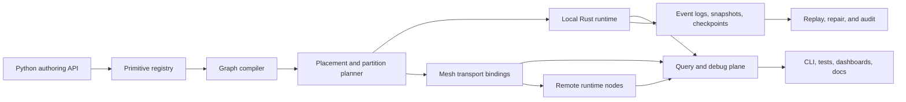

# Manyfold v1.0.0 Vision

This document describes an ideal v1.0.0 target for Manyfold. It is intentionally
ahead of the current `0.1.x` package, but it stays close to the concepts already
present in the repository: typed routes, graph-visible operators, taints, query
surfaces, durable components, mesh primitives, and the distributed-systems lego
catalog.

v1.0.0 should make Manyfold a small but serious runtime for distributed graph
computing: users compose primitive building blocks into typed execution graphs,
place those graphs across runtimes, and inspect the resulting system with the
same vocabulary used to build it.

## Problem

Distributed programs usually hide their actual graph in callbacks, queues,
brokers, retry loops, service clients, and dashboards. That makes the system
hard to reason about:

- Dataflow, backpressure, placement, and retry behavior are often implicit.
- Metadata, payload loading, state, and write feedback loops are mixed together.
- Distributed correctness is described in prose instead of encoded in reusable
  primitives.
- Operators such as joins, queues, leases, consensus, replication, and repair do
  not compose cleanly because they use different identity and observability
  models.

Manyfold already points at a better shape. v1.0.0 should turn that shape into a
coherent product boundary: a runtime where distributed graph topology, primitive
dependencies, and operational semantics are first-class objects.

Non-goals for v1.0.0:

- A universal message broker replacement.
- A visual patchbay as the primary interface.
- Magic exactly-once delivery across arbitrary links.
- A large cloud control plane required for local use.
- A framework that hides distributed trade-offs behind friendly names.

## Design

### Assumptions

- Python remains the primary authoring surface.
- Rust remains the hot-path runtime and PyO3 bridge.
- The local in-memory runtime remains useful on its own.
- The `manyfold.graph` module is allowed to host advanced distributed helpers
  while the top-level namespace stays narrow.
- The lego catalog becomes executable metadata over time, not just prose.

### v1.0.0 Product Shape

Manyfold v1.0.0 should support three nested usage levels:

- **Local graph runtime**: typed routes, ports, schemas, envelopes, operators,
  mailboxes, windows, joins, write bindings, taints, lineage, and query surfaces
  work in one process.
- **Primitive builder**: users define reusable legos with `requires`,
  `provides`, policies, failure semantics, query descriptors, and installers
  that lower into graph routes and nodes.
- **Distributed graph runtime**: a graph can be partitioned across runtime
  nodes with explicit placement, transport links, durable checkpoints, mesh
  primitives, and queryable control-plane state.

The intended mental model is:

```text
typed primitive -> graph component -> placed graph partition -> distributed runtime
```

Each layer should preserve identity, contracts, and inspection. A lease should
still look like a lease after it is installed as routes, logs, timers, and
versioned state. A repartitioned join should still show which keys moved, which
route introduced the movement, and which taints or delivery guarantees changed.

### Architecture



The compiler should produce a graph manifest that is stable enough to diff,
test, validate, and deploy. The runtime should execute that manifest while
emitting the same route, edge, primitive, and taint identities back through the
query plane.

### Primitive Builder

The v1 primitive builder should turn the distributed-systems lego catalog into
an executable contract system.

A primitive should describe:

- `name`: stable conceptual name, such as `Lease`, `DurableQueue`, or
  `RepartitionJoin`.
- `layer`: atom, policy, property, capability, local, durable, distributed, or
  application.
- `requires`: lower-level primitives or capabilities.
- `provides`: capabilities, properties, routes, query surfaces, or state.
- `inputs` and `outputs`: typed ports, mailboxes, stores, policies, and clocks.
- `state`: volatile, durable, replicated, or external state owned by the
  primitive.
- `failure_semantics`: crash, retry, timeout, duplicate, stale-owner, and
  partition behavior.
- `installer`: a function that lowers the primitive into routes, graph nodes,
  stores, mesh bindings, and query descriptors.
- `validation`: static checks that reject unsafe or underspecified wiring before
  execution.

This makes primitives more than helpers. They become inspectable components with
machine-checkable dependencies and failure contracts.

Example v1-level primitive families:

- Flow: `Capacitor`, `Resistor`, `RateLimiter`, `Semaphore`, `FlowControl`.
- Handoff: `Mailbox`, `DurableQueue`, `AckTracker`, `ConsumerGroup`.
- State: `Keyspace`, `EventLog`, `SnapshotStore`, `CheckpointStore`,
  `MaterializedView`.
- Coordination: `Heartbeat`, `FailureDetector`, `Lease`, `Quorum`,
  `LeaderElection`, `Consensus`.
- Partitioning: `PartitionMap`, `ShardMap`, `MigrationFence`, `Rebalancer`,
  `RepartitionJoin`.
- Replication: `ReplicaSet`, `Replicator`, `ReplicatedLog`,
  `AntiEntropyRepair`.
- Operations: `RouteAudit`, `LineageQuery`, `TaintRepair`, `RolloutController`,
  `KillSwitch`.

### Distributed Graph Computing

v1.0.0 should make distribution a graph concern rather than a deployment
afterthought.

Core concepts:

- **Graph manifest**: immutable description of routes, ports, schemas, edges,
  primitives, placement constraints, stores, links, and query capabilities.
- **Runtime node**: one process capable of hosting graph partitions and exposing
  query/debug routes.
- **Partition**: a named subgraph with ownership, state, mailbox boundaries,
  checkpoint positions, and placement constraints.
- **Mesh link**: typed transport binding with declared delivery, ordering,
  security, payload, and replay capabilities.
- **Placement plan**: compiler output mapping graph partitions and state to
  runtime nodes.
- **Control plane**: desired topology, observed topology, rollout state,
  membership, leases, and repair status represented as graph routes.

Critical flows:

1. Build a local graph from typed routes and primitive installers.
2. Compile it into a manifest with explicit primitive dependencies.
3. Validate schemas, policies, taints, placement, link capabilities, and
   cross-partition joins.
4. Plan partitions across runtime nodes.
5. Start each runtime node with its assigned graph partition.
6. Use mesh links to move closed metadata eagerly and open payloads on demand.
7. Persist event logs, snapshots, and checkpoints according to primitive
   contracts.
8. Inspect the live system through route audit, lineage, taints, flow,
   scheduler, watermarks, and primitive query surfaces.

The runtime should make it hard to express:

- hidden unbounded queues,
- direct unsafe feedback loops,
- cross-partition all-to-all joins without an explicit plan,
- payload-heavy inspection when metadata would be enough,
- stale-owner writes without a fencing token,
- a retry loop whose idempotency boundary is unknown,
- a transport crossing that silently drops ordering, durability, or trust.

### v1.0.0 Acceptance Criteria

v1.0.0 is ready when the repository can demonstrate the following in code,
tests, and docs:

- A stable public local graph API with typed routes, ports, schemas, envelopes,
  mailboxes, stateful operators, joins, write bindings, taints, lineage, and
  query surfaces.
- A primitive-definition API that can express the main lego catalog families and
  lower at least `DurableQueue`, `Lease`, `RepartitionJoin`, `Replicator`, and
  `Consensus` into graph-visible parts.
- A graph manifest format that can be generated, diffed, validated, and loaded
  by the Rust-backed runtime.
- A multi-process example where two or more runtime nodes exchange graph events
  through typed mesh links.
- A partitioned-state example where checkpoint, replay, migration fence, and
  route audit explain how ownership moved.
- A distributed join example that distinguishes local, lookup, broadcast mirror,
  repartition, and rejected all-to-all cases.
- A query-plane example where an external client inspects flow, lineage, taints,
  watermarks, scheduler state, and primitive health without breaking route
  capabilities.
- A compatibility policy for schemas, graph manifests, primitive contracts, and
  public Python APIs.

### Milestones

1. **0.2: Manifested local runtime**  
   Generate and validate graph manifests for the existing local runtime. Keep
   execution local, but require graph-visible identity for routes, mailboxes,
   state, taints, and query surfaces.

2. **0.3: Executable primitive catalog**  
   Move the lego catalog from static descriptions to installable primitive
   definitions with dependency validation and generated docs.

3. **0.4: Durable graph state**  
   Stabilize event logs, snapshots, checkpoints, idempotency, deduplication, and
   materialized views behind typed graph components.

4. **0.5: Mesh links and distributed query**  
   Run graph partitions in multiple processes with typed transport capabilities
   and federated query/debug surfaces.

5. **0.6: Placement and partition planning**  
   Add compiler support for placement constraints, partition maps, migration
   fences, rebalancing, and repartitioned operators.

6. **0.7: Coordination and replication primitives**  
   Ship serious `Lease`, `LeaderElection`, `Consensus`, `Replicator`, and
   `AntiEntropyRepair` primitives with explicit failure semantics.

7. **0.8: Production hardening**  
   Add compatibility guarantees, metrics, tracing, restart tests, fault
   injection, load tests, packaging, and documentation for supported profiles.

8. **1.0: Stable distributed graph runtime**  
   Freeze the supported public API, manifest version, primitive contract shape,
   and operational acceptance suite.

## Open Questions

- How much of the manifest should be generated from Python objects versus
  authored as checked configuration?
- Should the first distributed transport be local TCP, Unix sockets, shared
  memory, or a small in-process test transport with process boundaries simulated?
- Which primitive contracts should be stable at v1.0.0 and which should remain
  experimental under `manyfold.graph`?
- What is the minimum durability story for v1.0.0: local file store, pluggable
  byte store, SQLite, or an abstract store interface with one supported
  implementation?
- Should primitive installers be pure manifest builders, runtime mutators, or a
  two-phase API that can do both?
- How should schema compatibility be checked across Python, Rust, and generated
  wire descriptors?
- Which guarantees are required for a "supported" mesh link, and which should be
  surfaced as taints?
- What failure-injection suite is strong enough to call `Lease`, `Replicator`,
  and `Consensus` real rather than illustrative?

## Future Ideas

- Visual graph inspection generated from the manifest and live query plane.
- Code generation for route symbols, primitive contracts, and schema
  descriptors.
- A simulator that runs a distributed manifest with fault injection, time
  control, partition events, and deterministic replay.
- Cross-language runtime nodes that consume the same manifest and wire schema.
- Policy packs for embedded devices, edge runtimes, batch workers, and
  low-trust external clients.
- A hosted dashboard, if the local CLI and manifest/query model prove stable
  first.
