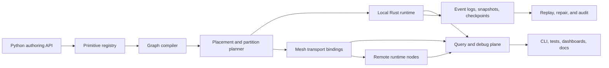

# Manyfold v1.0.0 Vision

This document describes an ideal v1.0.0 target for Manyfold. It is intentionally
ahead of the current `0.1.x` package, but it stays close to the concepts already
present in the repository: typed routes, graph-visible operators, taints, query
surfaces, durable components, mesh primitives, and the distributed-systems lego
catalog.

v1.0.0 should make Manyfold a small but serious runtime for distributed graph
computing: users compose primitive building blocks into typed execution graphs,
place those graphs across runtimes, and inspect the resulting system with the
same vocabulary used to build it.

## Problem

Distributed programs usually hide their actual graph in callbacks, queues,
brokers, retry loops, service clients, and dashboards. That makes the system
hard to reason about:

- Dataflow, backpressure, placement, and retry behavior are often implicit.
- Metadata, payload loading, state, and write feedback loops are mixed together.
- Distributed correctness is described in prose instead of encoded in reusable
  primitives.
- Operators such as joins, queues, leases, consensus, replication, and repair do
  not compose cleanly because they use different identity and observability
  models.

Manyfold already points at a better shape. v1.0.0 should turn that shape into a
coherent product boundary: a runtime where distributed graph topology, primitive
dependencies, and operational semantics are first-class objects.

Non-goals for v1.0.0:

- A universal message broker replacement.
- A visual patchbay as the primary interface.
- Magic exactly-once delivery across arbitrary links.
- A large cloud control plane required for local use.
- A framework that hides distributed trade-offs behind friendly names.

## Working Backward From v1

The v1.0.0 release should be planned around a few concrete stories rather than
only a list of primitives. These stories are intentionally demanding, but each
one can be built from concepts already present in the package.

### Story 1: Local Graph, Production Semantics

A developer should be able to build a local graph that handles bursty sensor
input, lazy bulk payloads, stateful aggregation, write feedback, and route audit
without leaving Python.

The graph should answer:

- Which routes exist, who owns them, and which schemas do they carry?
- Where are buffers, mailboxes, windows, joins, retries, and scheduler guards?
- Which outputs depend on which inputs, payloads, writes, and control epochs?
- Which taints were introduced, propagated, or repaired?
- Which payloads were opened because of downstream demand?

The important v1 bar is not raw feature count. The bar is that execution
semantics are visible enough that callback code, logs, and queue dashboards are
not the source of truth.

### Story 2: Build A Primitive Once

A developer should be able to define a primitive such as `DurableQueue`,
`Lease`, or `Replicator` once, then install it into multiple graphs with
different policies and stores.

The primitive should bring its own:

- dependency requirements,
- route templates,
- state and storage requirements,
- policy knobs,
- failure semantics,
- query surfaces,
- static validation,
- documentation generated from the same contract the runtime uses.

The result should be a component that is small enough to reason about but real
enough to be reused. A `Lease` should not be a paragraph in a design document;
it should be a composed object built from deadlines, renew/release
capabilities, fencing tokens, versioned state, and explicit stale-owner
behavior.

### Story 3: Partition A Graph Across Runtimes

A developer should be able to take a graph that works locally and run selected
parts in separate runtime nodes. The partition boundary should be represented
as graph structure, not hidden in deployment scripts.

The distributed version should preserve:

- route and port identities,
- schema compatibility,
- primitive ownership,
- mailbox and flow semantics,
- taint propagation,
- lineage across links,
- query/debug visibility,
- declared transport limitations.

If a link cannot preserve ordering, durability, trust, replay, or lazy payload
fetch, that loss should be declared and visible as policy, query output, or
taint.

### Story 4: Move Ownership Safely

A partitioned graph should be able to move ownership of state or work from one
runtime node to another with enough structure to debug the move later.

That means v1 needs an end-to-end story for:

- current owner,
- desired owner,
- partition map epoch,
- migration fence,
- checkpoint position,
- replay or snapshot source,
- catch-up progress,
- handoff completion,
- stale-owner rejection,
- route audit evidence.

This can start with one supported migration path. It does not need every
rebalancing strategy at v1.0.0, but the model should be strong enough that new
strategies can be added without changing the vocabulary.

## Design

### Assumptions

- Python remains the primary authoring surface.
- Rust remains the hot-path runtime and PyO3 bridge.
- The local in-memory runtime remains useful on its own.
- The `manyfold.graph` module is allowed to host advanced distributed helpers
  while the top-level namespace stays narrow.
- Python APIs should be object-shaped by default. Strings, dictionaries, and
  path-style lookups belong at serialization, CLI, logging, and compatibility
  boundaries, not in the primary authoring or inspection surface.
- The lego catalog becomes executable metadata over time, not just prose.
- Compatibility work favors explicit versioned manifests over implicit best
  effort upgrades.
- Early distributed examples can use local processes, but the API should not
  depend on all nodes sharing memory.

### v1.0.0 Product Shape

Manyfold v1.0.0 should support three nested usage levels:

- **Local graph runtime**: typed routes, ports, schemas, envelopes, operators,
  mailboxes, windows, joins, write bindings, taints, lineage, and query surfaces
  work in one process.
- **Primitive builder**: users define reusable legos with `requires`,
  `provides`, policies, failure semantics, query descriptors, and installers
  that lower into graph routes and nodes.
- **Distributed graph runtime**: a graph can be partitioned across runtime
  nodes with explicit placement, transport links, durable checkpoints, mesh
  primitives, and queryable control-plane state.

The intended mental model is:

```text
typed primitive -> graph component -> placed graph partition -> distributed runtime
```

Each layer should preserve identity, contracts, and inspection. A lease should
still look like a lease after it is installed as routes, logs, timers, and
versioned state. A repartitioned join should still show which keys moved, which
route introduced the movement, and which taints or delivery guarantees changed.

### Architecture



The compiler should produce a graph manifest that is stable enough to diff,
test, validate, and deploy. The runtime should execute that manifest while
emitting the same route, edge, primitive, and taint identities back through the
query plane.

The in-process manifest API should expose typed objects, such as route refs,
edge records, descriptor blocks, primitive records, and policy records. JSON,
TOML, Protobuf, and string paths are serialization formats for review and
interop; they should not become the shape users navigate in Python.

### Layer Boundaries

v1.0.0 should keep four boundaries crisp.

| Boundary | Owns | Must not hide |
| --- | --- | --- |
| Authoring API | typed routes, primitive installation, graph composition | queueing, retries, placement, transport loss |
| Compiler | manifest generation, validation, lowering, placement inputs | runtime health, mutable observed state |
| Runtime | event delivery, stores, mailboxes, operators, query routes | undeclared policy or capability changes |
| Control plane | desired state, observed state, rollout, ownership movement | data-plane payloads or user callbacks |

This split keeps Manyfold from becoming either a Python-only helper library or a
large opaque platform. The authoring API describes intent, the compiler makes it
checkable, the runtime executes it, and the control plane moves it safely.

### Primitive Builder

The v1 primitive builder should turn the distributed-systems lego catalog into
an executable contract system.

A primitive should describe:

- `name`: stable conceptual name, such as `Lease`, `DurableQueue`, or
  `RepartitionJoin`.
- `layer`: atom, policy, property, capability, local, durable, distributed, or
  application.
- `requires`: lower-level primitives or capabilities.
- `provides`: capabilities, properties, routes, query surfaces, or state.
- `inputs` and `outputs`: typed ports, mailboxes, stores, policies, and clocks.
- `state`: volatile, durable, replicated, or external state owned by the
  primitive.
- `failure_semantics`: crash, retry, timeout, duplicate, stale-owner, and
  partition behavior.
- `installer`: a function that lowers the primitive into routes, graph nodes,
  stores, mesh bindings, and query descriptors.
- `validation`: static checks that reject unsafe or underspecified wiring before
  execution.

This makes primitives more than helpers. They become inspectable components with
machine-checkable dependencies and failure contracts.

The contract does not need a final API shape today, but it should support a
style like this:

```python
DurableQueue = Primitive.define(
    name="DurableQueue",
    layer="durable",
    requires=("EventLog", "CheckpointStore", "AckTracker", "VisibilityDeadline"),
    provides=("Append", "Subscribe", "Ack", "Nack", "Replayable", "Bounded"),
    state=("event_log", "checkpoint", "inflight"),
    policies=("ordering", "overflow", "retry", "visibility_timeout"),
)
```

The installer should then be able to lower that definition into concrete graph
parts:

```python
queue = DurableQueue.install(
    graph,
    name="image_jobs",
    schema=ImageJob,
    store=store.prefix("image_jobs"),
    capacity=1000,
    visibility_timeout=Duration.seconds(30),
)

graph.connect(camera_frames, queue.ingress)
graph.connect(queue.egress, image_worker)
```

Those snippets are illustrative rather than a committed API. The committed v1
requirement is that the primitive contract, installed graph, generated docs, and
query surfaces all agree.

Example v1-level primitive families:

- Flow: `Capacitor`, `Resistor`, `RateLimiter`, `Semaphore`, `FlowControl`.
- Handoff: `Mailbox`, `DurableQueue`, `AckTracker`, `ConsumerGroup`.
- State: `Keyspace`, `EventLog`, `SnapshotStore`, `CheckpointStore`,
  `MaterializedView`.
- Coordination: `Heartbeat`, `FailureDetector`, `Lease`, `Quorum`,
  `LeaderElection`, `Consensus`.
- Partitioning: `PartitionMap`, `ShardMap`, `MigrationFence`, `Rebalancer`,
  `RepartitionJoin`.
- Replication: `ReplicaSet`, `Replicator`, `ReplicatedLog`,
  `AntiEntropyRepair`.
- Operations: `RouteAudit`, `LineageQuery`, `TaintRepair`, `RolloutController`,
  `KillSwitch`.

### Primitive Maturity Levels

The catalog should distinguish maturity so v1.0.0 can be honest without being
small.

- **Named**: documented lego exists with dependencies and intended contract.
- **Installable**: a primitive can lower into graph routes, nodes, stores, and
  query descriptors.
- **Validated**: static checks reject invalid wiring and missing policies.
- **Executable**: tests run the installed primitive through real graph/runtime
  behavior.
- **Fault-tested**: restart, duplicate, timeout, stale-owner, or partition
  cases are exercised.
- **Stable**: public contract and manifest representation are covered by a
  compatibility policy.

v1.0.0 should mark only a focused subset as stable. The rest can remain named,
installable, or experimental if the docs and query output say so directly.

### Distributed Graph Computing

v1.0.0 should make distribution a graph concern rather than a deployment
afterthought.

Core concepts:

- **Graph manifest**: immutable description of routes, ports, schemas, edges,
  primitives, placement constraints, stores, links, and query capabilities.
- **Runtime node**: one process capable of hosting graph partitions and exposing
  query/debug routes.
- **Partition**: a named subgraph with ownership, state, mailbox boundaries,
  checkpoint positions, and placement constraints.
- **Mesh link**: typed transport binding with declared delivery, ordering,
  security, payload, and replay capabilities.
- **Placement plan**: compiler output mapping graph partitions and state to
  runtime nodes.
- **Control plane**: desired topology, observed topology, rollout state,
  membership, leases, and repair status represented as graph routes.

Critical flows:

1. Build a local graph from typed routes and primitive installers.
2. Compile it into a manifest with explicit primitive dependencies.
3. Validate schemas, policies, taints, placement, link capabilities, and
   cross-partition joins.
4. Plan partitions across runtime nodes.
5. Start each runtime node with its assigned graph partition.
6. Use mesh links to move closed metadata eagerly and open payloads on demand.
7. Persist event logs, snapshots, and checkpoints according to primitive
   contracts.
8. Inspect the live system through route audit, lineage, taints, flow,
   scheduler, watermarks, and primitive query surfaces.

The runtime should make it hard to express:

- hidden unbounded queues,
- direct unsafe feedback loops,
- cross-partition all-to-all joins without an explicit plan,
- payload-heavy inspection when metadata would be enough,
- stale-owner writes without a fencing token,
- a retry loop whose idempotency boundary is unknown,
- a transport crossing that silently drops ordering, durability, or trust.

### Graph Manifest

The graph manifest is the bridge between authoring, validation, runtime, and
operations. It should be deterministic, versioned, and friendly to code review.

It should include at least:

- manifest version and package/runtime compatibility range,
- route and port descriptors,
- schemas and schema versions,
- primitive instances and their contract versions,
- edge descriptors, including flow and mailbox policies,
- state stores, retention, durability, and replay settings,
- placement constraints and partition ownership,
- mesh links and link capabilities,
- query/debug route exposure,
- security capabilities for external principals,
- taint, watermark, scheduler, and lineage settings.

Illustrative shape:

```text
manifest manyfold.graph.v1
  route read.logical.camera.frames.meta.v1 schema=FrameMeta@1
  route read.bulk.camera.frames.payload.v1 schema=FramePayload@1
  primitive durable_queue:image_jobs contract=DurableQueue@1
  partition camera_ingest owner=node-a checkpoint=frames@142
  link camera_ingest -> image_workers transport=tcp ordered=true replay=false
  query route_audit enabled principals=ops
```

The actual format can be JSON, TOML, Protobuf, or generated Python metadata. The
important property is that the manifest is a product artifact: stable enough to
review, diff, load, validate, and attach to bug reports.

### Runtime Profiles

v1.0.0 should avoid a one-size-fits-all runtime promise. A small set of explicit
profiles is more useful.

- **Embedded-lite profile**: constrained route set, minimal buffering, no local
  durable store required, explicit transport framing, conservative query
  surface.
- **Local profile**: one process, full local graph operators, file-backed
  durable components, deterministic testing support.
- **Edge profile**: multiple processes on one host or LAN, mesh links,
  checkpoints, partition planning, and federated query.
- **Service profile**: longer-running nodes with compatibility policy, metrics,
  tracing, restart tests, and supported storage adapters.

Profiles should be additive where practical, but they should not pretend to
offer the same guarantees. A profile is a declared operating envelope.

### Query And Operations Model

The v1 query plane should treat operational inspection as part of the runtime
contract. A deployed graph should answer these questions without bespoke code:

- What is the current graph topology and manifest version?
- Which runtime node owns each partition?
- Which routes have active producers, subscribers, writers, or retained latest
  values?
- Which mailboxes, capacitors, queues, and rate limiters are exerting pressure?
- Which event-time watermarks and control epochs are holding work?
- Which lineage records explain a selected output?
- Which taints are present, repaired, or absorbing?
- Which primitive instances are healthy, degraded, or blocked?
- Which link capabilities were requested and which were actually provided?

Query responses should be typed streams where possible. A CLI or dashboard can
format those streams, but the graph should not depend on an external dashboard
to know itself.

### Failure Semantics

Every stable distributed primitive should document what happens for the failure
cases it claims to handle.

| Failure case | v1 expectation |
| --- | --- |
| Duplicate delivery | Deduplication or idempotency boundary is declared. |
| Timeout | Timeout policy emits graph-visible status or retry state. |
| Crash before ack | Durable queues can replay or expose loss as a capability limit. |
| Stale owner | Fencing token or epoch rejects stale writes. |
| Link partition | Runtime exposes degraded link and taints affected routes. |
| Schema mismatch | Compiler or link handshake rejects the connection. |
| Replay gap | Checkpoint/query surface reports the missing range. |

The goal is not to eliminate failure. The goal is to ensure failures land in the
graph vocabulary before users build systems that depend on undocumented
behavior.

### v1.0.0 Acceptance Criteria

v1.0.0 is ready when the repository can demonstrate the following in code,
tests, and docs:

- A stable public local graph API with typed routes, ports, schemas, envelopes,
  mailboxes, stateful operators, joins, write bindings, taints, lineage, and
  query surfaces.
- A primitive-definition API that can express the main lego catalog families and
  lower at least `DurableQueue`, `Lease`, `RepartitionJoin`, `Replicator`, and
  `Consensus` into graph-visible parts.
- A graph manifest format that can be generated, diffed, validated, and loaded
  by the Rust-backed runtime.
- A multi-process example where two or more runtime nodes exchange graph events
  through typed mesh links.
- A partitioned-state example where checkpoint, replay, migration fence, and
  route audit explain how ownership moved.
- A distributed join example that distinguishes local, lookup, broadcast mirror,
  repartition, and rejected all-to-all cases.
- A query-plane example where an external client inspects flow, lineage, taints,
  watermarks, scheduler state, and primitive health without breaking route
  capabilities.
- A compatibility policy for schemas, graph manifests, primitive contracts, and
  public Python APIs.
- A fault-injection suite for at least one stable handoff primitive, one stable
  coordination primitive, and one stable partitioning or replication primitive.
- A migration example where observed state, desired state, partition epochs, and
  route audit explain a safe ownership move.
- A documented profile matrix that says which guarantees are supported for
  embedded-lite, local, edge, and service profiles.

### v1 Release Gates

The release should not become `1.0.0` until these gates are true:

- **API gate**: public local graph and primitive APIs have typed signatures,
  docs, compatibility notes, and object-shaped inspection surfaces with
  serialization kept at explicit boundaries.
- **Manifest gate**: graph manifests are deterministic and validated in tests.
- **Runtime gate**: local runtime semantics are covered by real tests rather
  than stubs.
- **Distribution gate**: at least one multi-process example exercises mesh
  links, query federation, and payload/metadata behavior.
- **Durability gate**: event log, snapshot, checkpoint, and replay behavior are
  tested across restart.
- **Failure gate**: documented fault cases have tests or are explicitly outside
  the profile.
- **Operations gate**: route audit, lineage, flow, scheduler, watermarks, taints,
  and primitive health can be queried from running examples.
- **Docs gate**: README, onboarding, usage, performance, catalog, RFC, and v1
  vision agree on what is stable versus experimental.

### Milestones

1. **0.2: Manifested local runtime**  
   Generate and validate graph manifests for the existing local runtime. Keep
   execution local, but require graph-visible identity for routes, mailboxes,
   state, taints, and query surfaces.

2. **0.3: Executable primitive catalog**  
   Move the lego catalog from static descriptions to installable primitive
   definitions with dependency validation and generated docs.

3. **0.4: Durable graph state**  
   Stabilize event logs, snapshots, checkpoints, idempotency, deduplication, and
   materialized views behind typed graph components.

4. **0.5: Mesh links and distributed query**  
   Run graph partitions in multiple processes with typed transport capabilities
   and federated query/debug surfaces.

5. **0.6: Placement and partition planning**  
   Add compiler support for placement constraints, partition maps, migration
   fences, rebalancing, and repartitioned operators.

6. **0.7: Coordination and replication primitives**  
   Ship serious `Lease`, `LeaderElection`, `Consensus`, `Replicator`, and
   `AntiEntropyRepair` primitives with explicit failure semantics.

7. **0.8: Production hardening**  
   Add compatibility guarantees, metrics, tracing, restart tests, fault
   injection, load tests, packaging, and documentation for supported profiles.

8. **1.0: Stable distributed graph runtime**  
   Freeze the supported public API, manifest version, primitive contract shape,
   and operational acceptance suite.

## Open Questions

- How much of the manifest should be generated from Python objects versus
  authored as checked configuration?
- Should the first distributed transport be local TCP, Unix sockets, shared
  memory, or a small in-process test transport with process boundaries simulated?
- Which primitive contracts should be stable at v1.0.0 and which should remain
  experimental under `manyfold.graph`?
- What is the minimum durability story for v1.0.0: local file store, pluggable
  byte store, SQLite, or an abstract store interface with one supported
  implementation?
- Should primitive installers be pure manifest builders, runtime mutators, or a
  two-phase API that can do both?
- How should schema compatibility be checked across Python, Rust, and generated
  wire descriptors?
- Which guarantees are required for a "supported" mesh link, and which should be
  surfaced as taints?
- What failure-injection suite is strong enough to call `Lease`, `Replicator`,
  and `Consensus` real rather than illustrative?

## Future Ideas

- Visual graph inspection generated from the manifest and live query plane.
- Code generation for route symbols, primitive contracts, and schema
  descriptors.
- A simulator that runs a distributed manifest with fault injection, time
  control, partition events, and deterministic replay.
- Cross-language runtime nodes that consume the same manifest and wire schema.
- Policy packs for embedded devices, edge runtimes, batch workers, and
  low-trust external clients.
- A hosted dashboard, if the local CLI and manifest/query model prove stable
  first.
